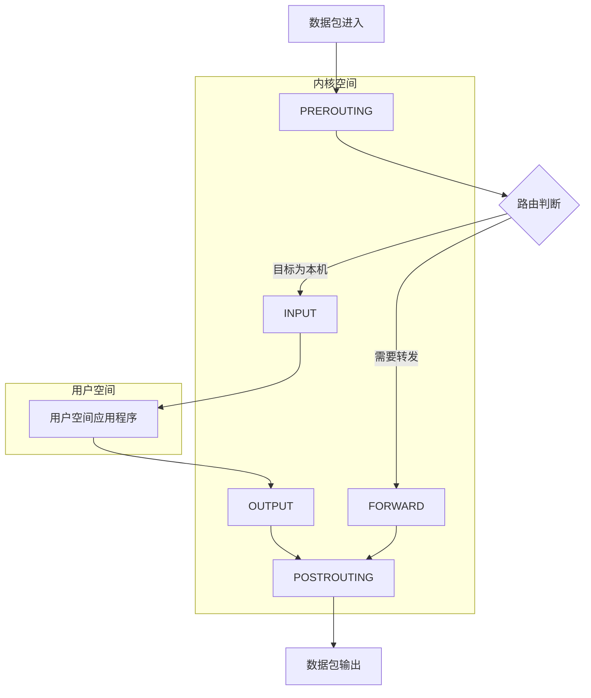
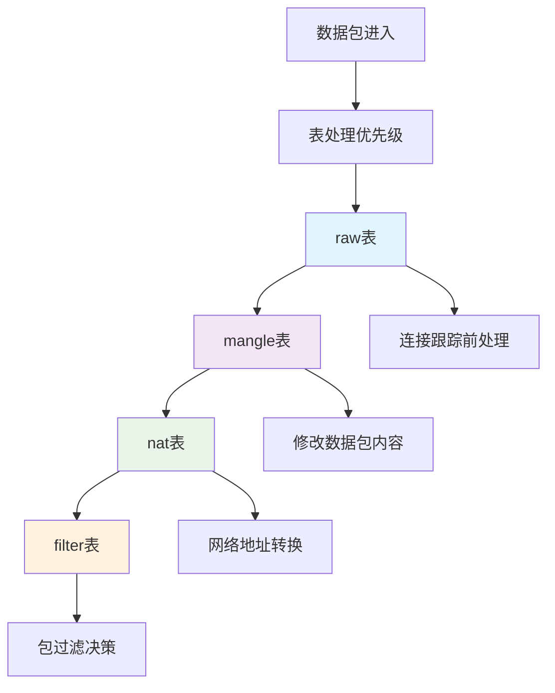
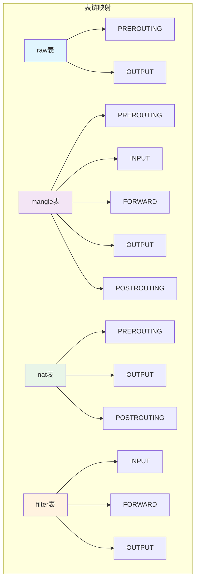
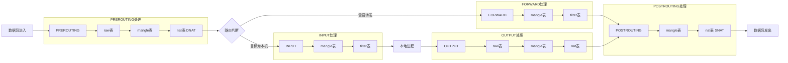

# iptables 详解

## 概述

防火墙是用于实现 Linux 访问控制功能的系统，工作在网络边缘，通过预定义策略检测出入网络的 IP 和数据包。

### 防火墙类型

- **三层/四层防火墙**：在网络层工作，检测源地址和目标地址
- **七层防火墙**：在应用层工作，检查所有数据内容
- **混合方案**：结合两者优势，平衡安全性与效率

## 演进历史

- **ipfirewall**（内核 1.x）：功能有限，规则需全部放入内核
- **ipchains**（内核 2.x）：支持规则串联
- **iptables**（现代）：规则列表形式，提供精细访问控制

> iptables 是用户空间的规则定义工具，实际防火墙功能由内核空间的 netfilter 实现。

## 核心架构

### 五个规则链



**规则链说明**：

1. **PREROUTING**：路由前处理
2. **INPUT**：进入本机数据包
3. **FORWARD**：转发数据包
4. **OUTPUT**：本机发出数据包
5. **POSTROUTING**：路由后处理

### 数据流向

- **入站流量**：PREROUTING → INPUT → 应用程序
- **出站流量**：应用程序 → OUTPUT → POSTROUTING
- **转发流量**：PREROUTING → FORWARD → POSTROUTING

## 表系统详解

### 表的概念层次



### 四张核心表

#### 1. raw 表

**特性**：最高优先级，连接跟踪前处理
**链**：PREROUTING、OUTPUT

```bash
# 性能优化：免跟踪 HTTP 流量
iptables -t raw -A PREROUTING -p tcp --dport 80 -j NOTRACK
iptables -t raw -A OUTPUT -p tcp --sport 80 -j NOTRACK
```

#### 2. mangle 表

**特性**：修改数据包内容（标记、TTL、TOS）
**链**：所有五链

```bash
# 流量标记
iptables -t mangle -A PREROUTING -p tcp --dport 22 -j MARK --set-mark 22
iptables -t mangle -A PREROUTING -j TTL --ttl-set 64
```

#### 3. nat 表

**特性**：网络地址转换
**链**：PREROUTING（DNAT）、OUTPUT、POSTROUTING（SNAT）

```bash
# 端口转发
iptables -t nat -A PREROUTING -p tcp --dport 80 -j DNAT --to 192.168.1.100:8080
# 共享上网
iptables -t nat -A POSTROUTING -s 192.168.1.0/24 -j MASQUERADE
```

#### 4. filter 表

**特性**：默认表，数据包过滤
**链**：INPUT、FORWARD、OUTPUT

```bash
# 基础访问控制
iptables -A INPUT -p tcp --dport 22 -j ACCEPT
iptables -A INPUT -s 192.168.1.100 -j DROP
iptables -A INPUT -i lo -j ACCEPT
```

### 表链关系总览



### 完整处理流程



## 命令语法

### 基础格式

```bash
iptables [-t 表] -命令 匹配 操作
```

### 核心命令

| 命令          | 功能         | 示例                                              |
| ------------- | ------------ | ------------------------------------------------- |
| `-P --policy` | 定义默认策略 | `iptables -P INPUT DROP`                          |
| `-L --list`   | 查看规则列表 | `iptables -L -n -v`                               |
| `-A --append` | 追加规则     | `iptables -A INPUT -s 192.168.1.0/24 -j ACCEPT`   |
| `-I --insert` | 插入规则     | `iptables -I INPUT 1 -p tcp --dport 22 -j ACCEPT` |
| `-D --delete` | 删除规则     | `iptables -D INPUT 3`                             |
| `-F --flush`  | 清空所有规则 | `iptables -F`                                     |

### 匹配条件

| 选项                 | 功能     | 示例                   |
| -------------------- | -------- | ---------------------- |
| `-i --in-interface`  | 输入接口 | `-i eth0`              |
| `-o --out-interface` | 输出接口 | `-o eth1`              |
| `-p --proto`         | 协议类型 | `-p tcp`               |
| `-s --source`        | 源地址   | `-s 192.168.1.100`     |
| `--sport`            | 源端口   | `--sport 8080`         |
| `--dport`            | 目的端口 | `--dport 80`           |
| `-m --match`         | 匹配模块 | `-m state --state NEW` |

### 处理动作

- **ACCEPT**：允许通过
- **DROP**：静默丢弃
- **REJECT**：拒绝并返回错误
- **LOG**：记录日志
- **SNAT/DNAT**：地址转换
- **MASQUERADE**：IP 伪装

## 实用配置示例

### 基础防火墙配置

```bash
# 清空现有规则
iptables -F
iptables -X

# 设置默认策略
iptables -P INPUT DROP
iptables -P FORWARD DROP
iptables -P OUTPUT ACCEPT

# 允许本地回环
iptables -A INPUT -i lo -j ACCEPT

# 允许已建立连接
iptables -A INPUT -m state --state ESTABLISHED,RELATED -j ACCEPT

# 开放服务端口
iptables -A INPUT -p tcp --dport 22 -j ACCEPT    # SSH
iptables -A INPUT -p tcp --dport 80 -j ACCEPT    # HTTP
iptables -A INPUT -p tcp --dport 443 -j ACCEPT   # HTTPS

# 允许 ICMP (ping)
iptables -A INPUT -p icmp --icmp-type echo-request -j ACCEPT
```

### 网络地址转换

```bash
# 启用 IP 转发
echo 1 > /proc/sys/net/ipv4/ip_forward

# SNAT：内网共享上网
iptables -t nat -A POSTROUTING -s 192.168.1.0/24 -o eth0 -j MASQUERADE

# DNAT：端口映射
iptables -t nat -A PREROUTING -p tcp --dport 8080 -j DNAT --to 192.168.1.100:80
```

### 高级访问控制

```bash
# 基于 MAC 地址过滤
iptables -A INPUT -m mac --mac-source 00:0F:EA:91:04:08 -j DROP

# 连接数限制
iptables -A INPUT -p tcp --dport 80 -m connlimit --connlimit-above 10 -j DROP

# 频率限制
iptables -A INPUT -p tcp --dport 22 -m limit --limit 3/min -j ACCEPT

# 记录可疑流量
iptables -A INPUT -s 10.0.0.0/8 -j LOG --log-prefix "SPOOFED: "
iptables -A INPUT -s 10.0.0.0/8 -j DROP
```

### 规则管理技巧

```bash
# 查看带行号的规则
iptables -L INPUT -n --line-numbers

# 在指定位置插入规则
iptables -I INPUT 2 -s 192.168.1.50 -j ACCEPT

# 保存和恢复规则
iptables-save > /etc/iptables.rules
iptables-restore < /etc/iptables.rules

# 清空计数器
iptables -Z
```

## 最佳实践

1. **默认拒绝**：设置默认策略为 DROP，显式允许必要流量
2. **状态检测**：充分利用连接状态跟踪
3. **规则优化**：将常用规则放在前面提高效率
4. **日志记录**：对拒绝的流量添加日志以便排查
5. **定期备份**：保存规则配置防止意外丢失

通过合理组合四张表的功能，iptables 能够实现从基础包过滤到复杂网络地址转换的全方位网络控制。
