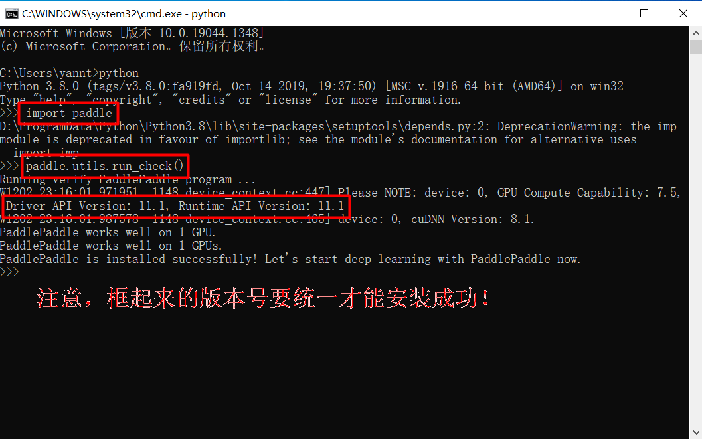
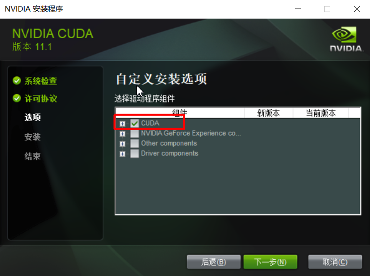
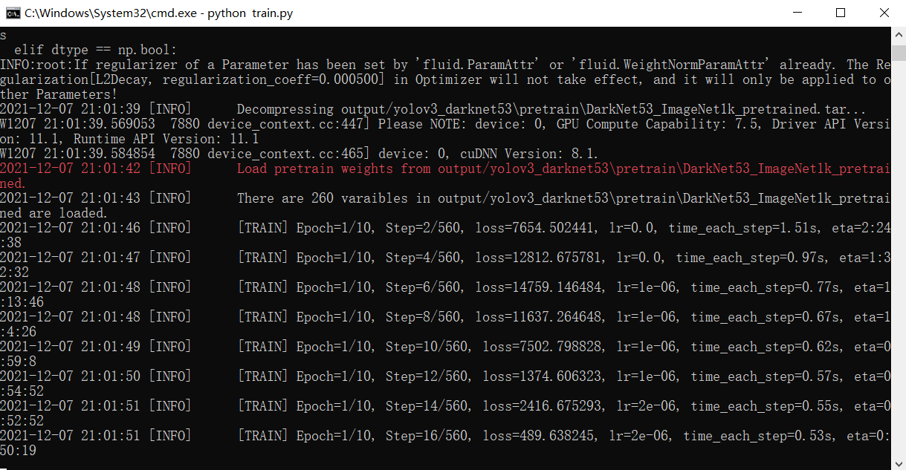

.. _training-with-gpu:

===================
用 GPU 训练神经网络
===================

英特尔（Intel）、超微半导体（AMD）、英伟达（NVIDIA）都是既生产 CPU 也生产 GPU。
不过，这三家公司也有些区别，比如 Intel 和 AMD 主要做 CPU，而 NVIDIA 主要做 GPU。

当然，还有一个体量不是那么大的公司就是 ARM，这家公司也是主要做 CPU。
Intel 和 AMD 做的 CPU 主要是 x86 架构，ARM 做的 CPU 则是 ARM 架构。
x86 架构普遍用在了个人电脑，服务器等高端设备上，而 ARM 架构更多地部署在性能不那么高的单片机等硬件上。
为了满足通用性，x86 架构的处理器通常都采用 CISC 指令集；
为了满足更加丰富的定制性，ARM 架构通常采用 RISC 指令集。

.. note::

    i386 是指 32 位版本，而 AMD64 (或 x86_64) 是指 Intel 和 AMD 处理器的 64 位版本 [1]_。

GPU 和 CPU 本质上属于同类型的产品，只不过侧重点不一样，CPU 偏向控制，GPU 偏向计算。

注意，为笔记本电脑上显示器提供输出的 GPU 不算是本文提及的 GPU。

我们通常说的显卡不等于 GPU，它是一块集成板卡。显卡由 GPU、显存、电路板、BIOS 固件组成。
GPU 是显卡的核心，它是显卡上的一块芯片，因此我们很多时候提到显卡，关注的重点往往是 GPU。

通常说到处理器，指的一般是 Intel 和 AMD 生产的 CPU（中央处理器），CPU 是主板上的一块芯片。
但是，容易被大家忽略的是 GPU 也是处理器，它是图形处理器。
关于 CPU 和 GPU 的区别，可以阅读
`这篇文章 <https://www.intel.cn/content/www/cn/zh/products/docs/processors/cpu-vs-gpu.html>`_\。
总结一句话，仅有 GPU 无法完成工作，需要 CPU 的支持，而 CPU 更适合串行任务，GPU 则更适合并行任务。

打开任务管理器后，我们或许会看到这样一张图：

.. image:: ../_static/images/gpuinfo.png

图中的共享 GPU 内存，是集成显卡的一部分。集成或共享显卡内置在 CPU 所处的同一个芯片上。
与依赖于专用或独立显卡的 CPU 相比，某些 CPU 可以配备内置式 GPU。
集成显卡有时也被称为集成显卡处理器（IGP），与 CPU 共享内存。
集显专用内存是 BIOS 从系统内存（RAM）划分出来的，因此，共享显存容量可以通过 BIOS 来设置。
如果将 RAM 的一些存储容量分配给某张显卡时，其他显卡和电脑零件（比如 BIOS 固件）就不能使用了。

独显专用内存是独显自带的内存。

共享 GPU 内存的速度会远低于专用 GPU 内存的速度。
深度学习算法通常需要用到更大更广泛的加速效果，因此，GPU 是一个更好的选择。
NVIDIA 的 Titan 系列、Intel 的 Xeon 系列，都可以通过官方软件包为算法落地提供便利。

对于深度学习来讲，到底需要一台什么配置的电脑呢？
根据我的目前的实验来看，深度学习不建议用个人电脑，服务器往往能提供更大的平台，让算法得以实现。

比如，我在笔记本电脑上首先安装了 PaddlePaddle，如下图所示。

然后用 PaddlePaddle 跑了 YOLO 模型，发现 batch_size 设置的稍微大一点就会发生程序内存溢出，不得改小这个值。
因此，如果非要在个人电脑上运行深度学习程序，那么不免在算法准确性和程序运行时间上做出一些妥协，因为根本跑不动。

用 GPU 训练网络肯定会用到 CUDA，但是，安装 CUDA 环境经常会出现一些问题，我们最好先用 ``nvidia-smi``
看一下电脑上的 Driver API Version，然后去官网下载一个\ **相同版本**\ 的
`CUDA Toolkit <https://developer.nvidia.com/cuda-toolkit-archive>`_ 以及与 CUDA 版本相对应的
`cuDNN <https://developer.nvidia.com/rdp/cudnn-archive>`_。

如果你已经安装了 Anaconda 或 Miniconda，那么使用 ``conda install cudatoolkit`` 和
``conda install cudnn`` 可以更加方便快捷地完成环境部署。当然，你也可以先从官网下载安装器，然后按照下面
UI 界面的提示进行安装。这个软件比较大，你可以不用完整安装，勾选如下选项即可：

安装完可以通过 ``nvcc --version``
命令查看 CUDA 是否安装成功。在 Python 中添加这样一行代码 ``os.environ['CUDA_VISIBLE_DEVICES'] = '0'``
就可以为你的程序加速了（前提是有 NVIDIA 的 GPU，这通过任务管理器可以查看，见本页第一张图）。
**但是，令人疑惑的是，我安装了 PaddlePaddle 的 GPU 版本，这句话不管设不设置，效果都一样，都用到了 GPU。**
英特尔 GPU 应该用什么加速，我没用过，暂时不知道。

根据你安装的 CUDA 版本，再去下载安装对应版本的
`PaddlePaddle <https://www.paddlepaddle.org.cn/install/quick>`_
应该就可以了，因为我的版本都是 11.1 所以，我用 pip 安装了 PaddlePaddle 的 11.1 版本。下图是成功后的训练过程：

另外，如果想查看本机的其他参数，可以使用下面几种方式中的一种：

- 设置 ``>>`` 系统 ``>>`` 关于
- Win + R ``>>`` msinfo32
- Win + R ``>>`` dxdiag
- PowerShell ``>>`` Get-ComputerInfo
- cmd.exe ``>>`` systeminfo
- 使用工具软件 `CPU-Z <https://www.cpuid.com/>`_

.. [1] https://ubuntuqa.com/article/371.html
