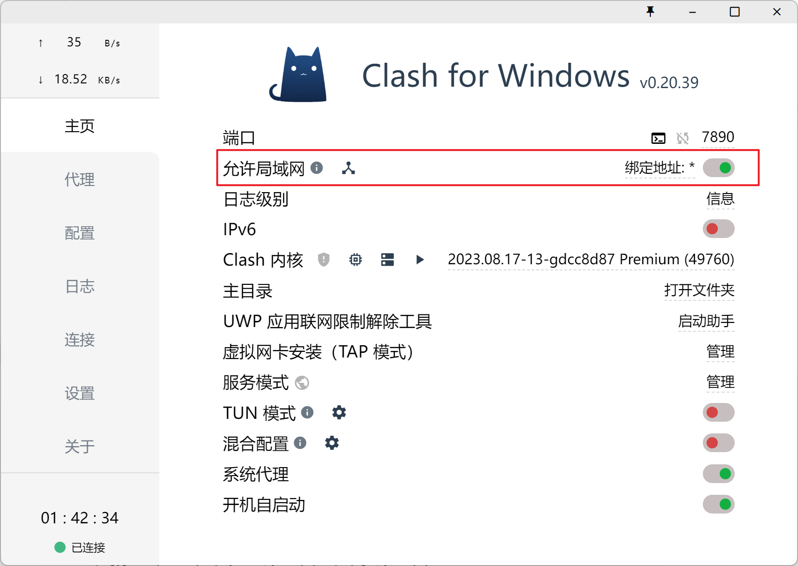

# WSL2 访问外网的配置方法

WSL2 可以通过使用 Windows 的代理来访问 Google。

## 方法一

在 PowerShell 中运行下面的命令，升级 WSL 到最新版本：

```bash
wsl --update --pre-release
```

然后，创建或编辑 `%UserProfile%/.wslconfig` 文件：

```
[wsl2]
nestedVirtualization=true
ipv6=true
[experimental]
autoMemoryReclaim=gradual # gradual | dropcache | disabled
networkingMode=mirrored
dnsTunneling=true
firewall=true
autoProxy=true
```

## 方法二

首先打开代理工具（比如 Clash）的局域网访问权限：



在 Ubuntu 中运行下面的命令，完成配置（端口号可能每个人都不一样，参考上图，我是 `7890`）：

```bash
cat <<EOF | tee -a ~/.bashrc
export ALL_PROXY="http://$(cat /etc/resolv.conf | grep nameserver | awk '{print $2}'):7890"
EOF
```
