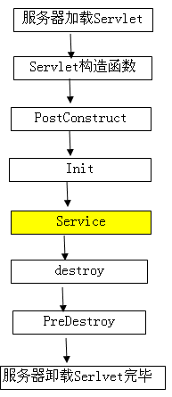

====
注解
====

什么是注解（Annotation）
------------------------

注解是放在Java源码的类、方法、字段、参数前的一种特殊 "注释"：

.. code-block:: java

    // this is a component:
    @Resource("hello")
    public class Hello {
        @Inject
        int n;

        @PostConstruct
        public void hello(@Param String name) {
            System.out.println(name);
        }

        @Override
        public String toString() {
            return "Hello";
        }
    }

注释会被编译器直接忽略，注解则可以被编译器打包进入 ``.class`` 文件，因此，注解是一种用作标注的 "元数据"。

元注解
------

元注解就是定义其他注解的注解。
比如 ``@Override`` 这个注解就不是一个元注解，而是通过元注解定义出来的。

.. code-block:: java

    @Target(ElementType.METHOD)
    @Retention(RetentionPolicy.SOURCE)
    public @interface Override {}

这里用到的 ``@Target`` 和 ``@Retention`` 就是元注解。

元注解只有四个：

- ``@Documented`` ：被修饰的注解类将被 javadoc 工具提取成文档
- ``@Inherited`` ：被修饰的注解类将具有继承性
- ``@Retention`` ：用于指定被修饰的注解可以存在于哪里（源代码、 ``.class`` 文件、运行时）
- ``@Target`` ：用于指定被修饰的注解修饰哪些程序单元（类、方法、字段）

自定义注解
----------

除了元注解，都是自定义注解。比如我们常用的 ``@Override`` 、 ``@Autowire``。

Java 语言使用 ``@interface`` 语法来定义自己的注解，格式如下：

.. code-block:: java

    @Retention(RetentionPolicy.RUNTIME)
    @Target(ElementType.METHOD)
    public @interface Report {
        int type() default 0;
        String level() default "info";
        String value() default "";
    }

注解的参数类似无参数方法，可以用 ``default`` 设定一个默认值（强烈推荐）。
最常用的参数应当命名为 ``value``。

一些常用的注解
--------------

**以下是 Java 中常用的注解：**

- ``@Override`` 表示当前方法覆盖了父类的方法。
- ``@Deprecation`` 表示方法已经过时，方法上有横线，使用时会警告。
- ``@SuppressWarnings`` 表示关闭一些警告信息。
- ``@SafeVarages`` 表示专门抑制 "堆污染" 警告提供的。
- ``@FunctionalInterface`` 用来指定某个接口必须是函数式接口，否则编译出错。

**以下是 Spring 中常用的注解：**

.. note::

    在学习 Spring 框架时，我们遇到的第一个也是最核心的概念就是容器 [1]_。

    什么是容器？容器是一种为某种特定组件的运行提供必要支持的一个软件环境。
    例如，Tomcat 就是一个 Servlet 容器，它可以为 Servlet 的运行提供运行环境。
    类似 Docker 这样的软件也是一个容器，它提供了必要的 Linux 环境以便运行一个特定的 Linux 进程。

    通常来说，使用容器运行组件，除了提供一个组件运行环境之外，容器还提供了许多底层服务。
    例如，Servlet 容器底层实现了 TCP 连接，解析 HTTP
    协议等非常复杂的服务，如果没有容器来提供这些服务，我们就无法编写像
    Servlet 这样代码简单，功能强大的组件。

    早期的 JavaEE 服务器提供的 EJB 容器最重要的功能就是通过 **声明式事务** 服务，使得 EJB
    组件的开发人员不必自己编写冗长的事务处理代码，所以极大地简化了事务处理。

    **Spring 的核心** 就是提供了一个 IoC 容器，它可以管理所有轻量级的 JavaBean
    组件，提供的底层服务包括组件的生命周期管理、配置和组装服务、AOP 支持，以及建立在 AOP
    基础上的 **声明式事务** 服务等。

    IoC（控制反转）容器提供了 **对组件进行生命周期管理和配置组装服务** 的功能。

    我们可以将 Spring 想象成一个组装工人，他在众多零件中找到我们需要的零件后，组装起来为我们提供服务。

    而我们使用的注解，就可以声明这是一个什么类型的组件。之后当我们后面需要使用这个某个组件的时候，Spring
    会自动帮我们组装。

如果一个类被 ``Configuration`` 注解，那它就是一个 IoC 容器，那些被标注了 ``@Bean``
的方法就是该容器中的基础服务，给全局提供服务。在我们编写的某个具体应用中，通常有以下的数据交换过程：

.. code-block:: text

    Database --- JDBC --- DAO --- Service --- Controller --- Axios --- Vue.js

因此，通常将软件按照三个层次编写组件：

- ``@Controller`` 表示控制层（Controller）组件，用于给前后端的通信。
- ``@Service`` 表示业务（Service）组件。
- ``@Repository`` 表示数据访问层（DAO）组件，用于访问数据库。

当组件不好归类的时候，我们可以使用 ``@Component`` 进行标注。

那么我们如果已经将组件都写好了，\ **如何装配呢？**
``@Autowired`` 默认按类型装配，如果我们想使用按名称装配，可以结合 ``@Qualifier`` 注解一起使用。
在我们没有声明使用哪个组件时，默认将使用被 ``@Primary`` 注解的组件，找不见就抛出异常。
``@Resource`` 默认按名称装配，当找不到与名称匹配的 Bean 才会按类型装配。

除了这些组件外，还有一些其他的组件，比如 ``@Scope`` 注解作用域、\ ``@Lazy(true)`` 表示延迟初始化。

然后，Spring 提供了一些声明周期相关的注解：

``@PostConstruct`` 用来修饰方法，标记在项目启动的时候执行这个方法，一般用来执行某些初始化操作比如全局配置。
被注解的方法会在构造函数之后执行，Servlet 的 ``init()`` 方法之前执行。
另外，可以用 ``@DependsOn`` 定义 Bean 初始化及销毁时的顺序。

注解的存活时间
--------------

**由编译器使用的注解**

比如 ``@Override`` 、 ``@SuppressWarnings``，编译后，这些注解不会进入 ``.class`` 文件，编译后就被扔掉了。

**由工具处理 ``.class`` 文件使用的注解**

比如在加载 ``.class`` 文件到内存的时候，对 ``.class`` 文件做动态修改，以实现一些特殊功能。

**在运行时能够读取的注解**

他们加载后一直存在于 JVM 中，比如 ``@PostConstruct`` 的方法会在调用构造方法后自动被调用。

注解和反射的结合
----------------

注解和反射经常结合在一起，在很多框架中都能看到他们的影子。

可以通过反射来判断类、方法、字段上是否有某个注解，以及获取注解中的值。

当开发者使用注解修饰了类、方法、字段后，这些注解不会自己生效，必须由开发者提供相应的代码来提取并处理注解信息。
这些处理提取和处理注解的代码统称为 APT（Annotation Processing Tool）。

作为示例，我们首先提出一个需求：
项目经理想跟踪一个项目中现在一共实现了多少个的用例。如果某个用例已经实现了，那么就添加一个 ``@UseCase`` 标记。
这样，我们就可以很方便地掌控项目的进展。而且，当用户需求发生变更时，也更容易定位代码，修改需求实现。

然后，我们开始写代码，首先定义 ``@UseCase`` 注解：

.. code-block:: java

    //: annotations/UseCase.java
    import java.lang.annotation.*;

    @Target(ElementType.METHOD)
    @Retention(RetentionPolicy.RUNTIME)
    public @interface UseCase {
        public int id();
        public String description() default "no description";
    } ///:~

然后，尝试使用这个注解。把这个注解用于 ``PasswordUtils`` 类的某个方法上：

.. code-block:: java

    //: annotations/PasswordUtils.java
    import java.util.*;

    public class PasswordUtils {
        @UseCase(id = 47, description = "Passwords must contain at least one numeric")
        public boolean validatePassword(String password) {
            return (password.matches("\\w*\\d\\w*"));
        }
        @UseCase(id = 48) // 注解并不会对方法的代码产生什么影响（也就是没有侵入性）
        public String encryptPassword(String password) {
        return new StringBuilder(password).reverse().toString();
        }
        @UseCase(id = 49, description = "New passwords can't equal previously used ones")
        public boolean checkForNewPassword(List<String> prevPasswords, String password) {
            return !prevPasswords.contains(password);
        }
    } ///:~

最后，我们需要解析注解。因为注解存活于运行时，我们使用反射机制，查找 ``@UseCase`` 标记，并获取它的值。

.. code-block:: java

    //: annotations/UseCaseTracker.java
    import java.lang.reflect.*;
    import java.util.*;

    public class UseCaseTracker {
        public static void trackUseCases(List<Integer> useCases, Class<?> cl) {
            for(Method m : cl.getDeclaredMethods()) {
                UseCase uc = m.getAnnotation(UseCase.class); // 对某个方法检查是否有对应的注解对象
                if(uc != null) { // 找到了，就拿出注解中的值
                    System.out.println("Found Use Case:" + uc.id() + " " + uc.description());
                    useCases.remove(new Integer(uc.id())); // 实现一个用例移除一个用例
                }
            }
            for(int i : useCases) { // 看看还有哪些用例没有实现
                System.out.println("Warning: Missing use case-" + i);
            }
        }
        public static void main(String[] args) {
            List<Integer> useCases = new ArrayList<Integer>();
            Collections.addAll(useCases, 47, 48, 49, 50); // 共有 47 48 49 50 四个用例需要实现
            trackUseCases(useCases, PasswordUtils.class);
        }
    } /* Output:
    Found Use Case:47 Passwords must contain at least one numeric
    Found Use Case:48 no description
    Found Use Case:49 New passwords can't equal previously used ones
    Warning: Missing use case-50
    *///:~

.. rubric:: 参考资料

.. [1] https://www.liaoxuefeng.com/wiki/1252599548343744/1266265100383840
