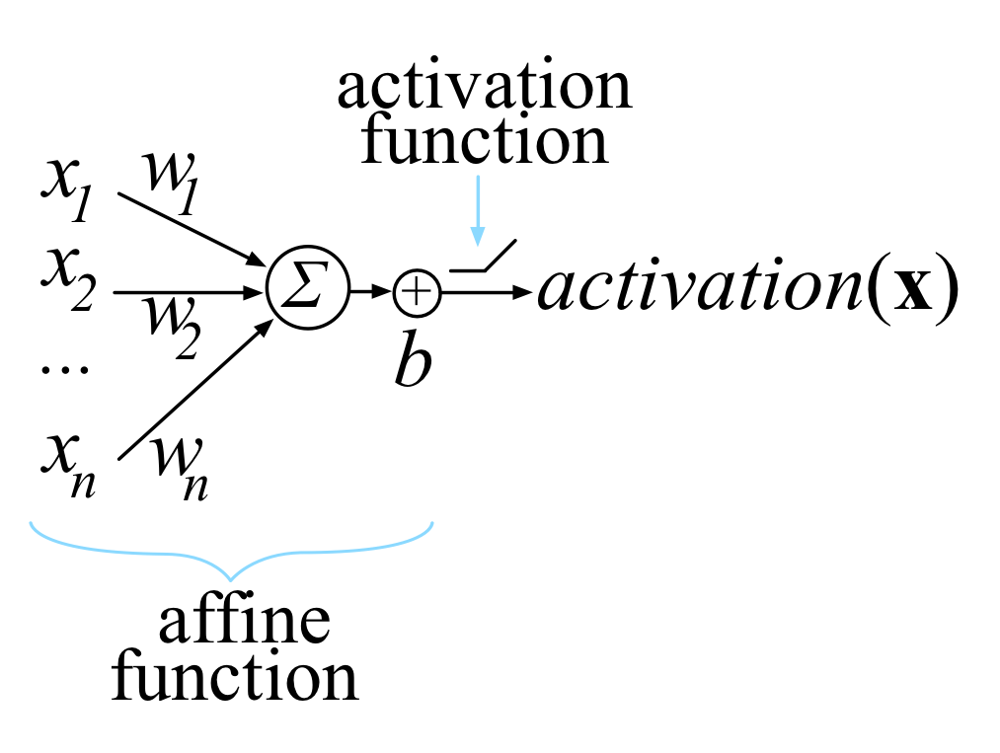

.. _vector-chain-rule:

==============
梯度及链式法则
==============

:footcite:t:`DBLP:journals/corr/abs-1802-01528` 对过程做了详细的推导，并对结论做了总结。

只有对前四章的数学基础完全理解后，才能对后续章节的应用做到了如指掌。

有时候想一想，这种计算规则，其实本质上就是约定个 shape 的事。

.. tip::

    - 向量或标量的一切运算规则都要基于标量运算规则，都要考虑转换到标量形式时才能进行相关计算；
    - 向量或矩阵的求导规则运用多元微分学的知识，对某个变量求导时，其他变量看作常数；
    - 学习路线：标量求导、向量求导、矩阵求导、一元微分(求导)链式法则、向量微分链式法则。

.. note::

    凡是书写数学相关的内容，都应当遵守 :ref:`符号定义 <symbol-definition>` 规则，这样方便后续阅读和理解，至少对于一个人来讲是如此。

    以前，我们知道含有变量的函数的求导方法 :math:`(x^2)'=2x`，现在对如果将 :math:`x` 表示为数字 5，那么他的导数是什么？很明显，我们以前的先验知识告诉我们，答案是 10。

    现在，因为在神经网络上，神经元之间的连接通常是线性关系，因此，大概率的情况下，不会出现二次方以及对数函数等其他我们在高中阶段就已经学习过的复杂函数。
    因为通常来讲，我们一般的做法是将神经元上的数字乘以与之相连接的边的权重，再加上某个偏置，即可得到输出。因此，对于单个神经元来讲，它就是线性的。

    正因为这种线性关系的存在，我们在下面的假设中，通常假设 :math:`\mathbf{f}(\mathbf{w})=\mathbf{w}`， :math:`\mathbf{g}(\mathbf{x})=\mathbf{x}`
    的隐含意思就是对于神经网络的某一层来讲，影响权值和偏置的函数有两个： :math:`f_i` 和 :math:`g_i`。它们分别作用于权重 :math:`f_i(\mathbf{w})` 和神经元 :math:`g_i(\mathbf{x})`。
    计算得到的结果用于下一层神经元的输入。

    但是为什么计算结果还是记作 :math:`\mathbf{w}` 和 :math:`\mathbf{b}` 呢？也就是说，为什么要假设 :math:`f_i(\mathbf{w})=\mathbf{w}` ？
    作者说，这是一个简单的例子，帮助我们理解相关原理应该如何被应用。这个例子虽然简单，但其特有的线性性质，帮助我们简化了计算过程和结果。

.. warning::

    关于全微分和偏微分的理解可能网络上并不一致。参考 :footcite:p:`DBLP:journals/corr/abs-1802-01528` 第 19 页，第 4 段。

.. _scalar-derivative-rules:

标量求导
--------

.. csv-table::
    :header: ":math:`f(x)`", "对 :math:`x` 求导", "Example"

    ":math:`c`", ":math:`0`", ":math:`\dfrac{\mathrm d}{\mathrm d x}99=0`"
    ":math:`cf`", ":math:`c\dfrac{\mathrm d f}{\mathrm d x}`", ":math:`\dfrac{\mathrm d}{\mathrm d x}3x=3`"
    ":math:`x^n`", ":math:`nx^{n-1}`", ":math:`\dfrac{\mathrm d}{\mathrm d x}x^3=3x^2`"
    ":math:`f+g`", ":math:`\dfrac{\mathrm d f}{\mathrm d x}+\dfrac{\mathrm d g}{\mathrm d x}`", ":math:`\dfrac{\mathrm d}{\mathrm d x}(x^2+3x)=2x+3`"
    ":math:`f-g`", ":math:`\dfrac{\mathrm d f}{\mathrm d x}-\dfrac{\mathrm d g}{\mathrm d x}`", ":math:`\dfrac{\mathrm d}{\mathrm d x}(x^2-3x)=2x-3`"
    ":math:`fg`", ":math:`f\dfrac{\mathrm d g}{\mathrm d x}+\dfrac{\mathrm d f}{\mathrm d x}g`", ":math:`\dfrac{\mathrm d}{\mathrm d x}(x^2x)=x^2+x2x=3x^2`"
    ":math:`f\big(g(x)\big)`", ":math:`\dfrac{\mathrm d f(u)}{\mathrm d u}\dfrac{\mathrm d u}{\mathrm d x}, let\ u= g(x)`", ":math:`\dfrac{\mathrm d}{\mathrm d x}\ln{x^2}=\dfrac{1}{x^2}2x=\dfrac{2}{x}`"

向量求导
--------

设 :math:`f(x, y) = 3 x^2 y`，即 :math:`\mathbf{x} = \begin{bmatrix} x \\ y \end{bmatrix}`， :math:`f(\mathbf{x})=3x^2y`。

:math:`\nabla f(x, y) =\begin{bmatrix}\dfrac{\partial f(x,y)}{\partial x}, \dfrac{\partial f(x,y)}{\partial y}\end{bmatrix}=\begin{bmatrix}6yx, 3x^2\end{bmatrix}`

.. note::

    这里使用了分子布局（ :math:`\mathit{Numerator\ layout}` ）。

.. tip::

    设向量 :math:`\mathbf{x}` 表示一组变量 :math:`\mathbf{x} = \begin{bmatrix} \mathit{x_1} \\ \mathit{x_1} \\ \vdots \\ \mathit{x_n} \\ \end{bmatrix}`，
    向量 :math:`\mathbf{f}` 表示一组函数 :math:`\mathbf{f} = \begin{bmatrix} \mathit{f_1} \\ \mathit{f_1} \\ \vdots \\ \mathit{f_m} \\ \end{bmatrix}`，
    当 :math:`\mathbf{f}` 中的某个函数 :math:`\mathit{f_i}` 作用于向量 :math:`\mathbf{x}` 时，其实质是
    :math:`f_i(\mathbf{x}) = 2 \mathit{x_1}^2 + 3 \mathit{x_2} + \dots` 这种形式。

矩阵求导
--------

设 :math:`\begin{bmatrix}f(x,y)=3x^2y \\ g(x,y)=2x+y^8 \end{bmatrix}`，则 :math:`\mathit{Jacobian\ matrix}` 为：

.. math::

    J =
        \begin{bmatrix}
            \nabla f(x,y) \\\\
            \nabla g(x,y)
        \end{bmatrix} =
        \begin{bmatrix}
            \dfrac{\partial f(x,y)}{\partial x} & \dfrac{\partial f(x,y)}{\partial y} \\\\
            \dfrac{\partial g(x,y)}{\partial x} & \dfrac{\partial g(x,y)}{\partial y}
        \end{bmatrix} =
        \begin{bmatrix}
            6yx & 3x^2 \\\\
            2 & 8y^7
        \end{bmatrix}

.. note::

    :math:`\mathit{Jacobian\ matrix}` 的一般形式： :math:`\mathbf{y}=\mathbf{f}(\mathbf{x})`。

    其中， :math:`\mathbf{x}=\begin{bmatrix} x_1 \\ x_2 \\ \vdots \\ x_n \end{bmatrix}`，
    :math:`\mathbf{y}=\begin{bmatrix} y_1 \\ y_2 \\ \vdots \\ y_m \end{bmatrix}`，
    :math:`\mathbf{f}(\mathbf{x})=\begin{bmatrix} f_1(\mathbf{x}) \\ f_2(\mathbf{x}) \\ \vdots \\ f_m(\mathbf{x}) \end{bmatrix}`
    ，将 :math:`f_i(\mathbf{x})` 展开后，可以得到标量形式 :math:`f_i(\mathbf{x}) = 2 \mathit{x_1}^2 + 3 \mathit{x_2} + \dots`
    。需要注意的是： :math:`|\mathbf{x}|=n` 但是 :math:`|\mathbf{y}|=|\mathbf{f}|=m`。

    .. math::

        J =
            \dfrac{\partial \mathbf{y}}{\partial \mathbf{x}} =
            \begin{bmatrix}
                \nabla f_1(\mathbf{x}) \\\\
                \nabla f_2(\mathbf{x}) \\\\
                \vdots \\\\
                \nabla f_m(\mathbf{x})
            \end{bmatrix} =
            \begin{bmatrix}
                \dfrac{\partial}{\partial \mathbf{x}}f_1(\mathbf{x}) \\\\
                \dfrac{\partial}{\partial \mathbf{x}}f_2(\mathbf{x}) \\\\
                \vdots \\\\
                \dfrac{\partial}{\partial \mathbf{x}}f_m(\mathbf{x})
            \end{bmatrix} =
            \begin{bmatrix}
                \dfrac{\partial}{\partial x_1}f_1(\mathbf{x}) & \dfrac{\partial}{\partial x_2}f_1(\mathbf{x}) & \dots & \dfrac{\partial}{\partial x_n}f_1(\mathbf{x}) \\\\
                \dfrac{\partial}{\partial x_1}f_2(\mathbf{x}) & \dfrac{\partial}{\partial x_2}f_2(\mathbf{x}) & \dots & \dfrac{\partial}{\partial x_n}f_2(\mathbf{x}) \\\\
                \vdots & \vdots & \ddots & \vdots \\\\
                \dfrac{\partial}{\partial x_1}f_m(\mathbf{x}) & \dfrac{\partial}{\partial x_2}f_m(\mathbf{x}) & \dots & \dfrac{\partial}{\partial x_n}f_m(\mathbf{x})
            \end{bmatrix}

    注意到，我们在展开 :math:`\dfrac{\partial \mathbf{y}}{\partial \mathbf{x}}` 时，是按照分子竖着展开，分母横着展开的，
    这种展开方式叫做分子布局（ :math:`\mathit{Numerator\ layout}` ）。
    其实还有另外相反的一种展开方式，叫做分母布局（ :math:`\mathit{Denominator\ layout}` ）。作者在论文中一直使用的是分子布局。

    这种展开规则 **很重要**，这是解向量求导问题的一个 **突破点**，学会了展开规则，向量求导就变得非常简单了，因为你可以通过目标方程目测出结果矩阵的形状，而且，结果矩阵是标量形式的。

.. tip::

    恒等函数（ :math:`\mathit{Identity\ function}` ） :math:`\mathbf{y}=\mathbf{f}(\mathbf{x})=\mathbf{x}`，即 :math:`y_i = f_i(\mathbf{x})=x_i`，在文中多次出现，是作为一个简单的 demo 来诠释概念是应该如何理解和应用的。

    这里需要注意的是在恒等函数中 :math:`|\mathbf{x}|=|\mathbf{y}|=|\mathbf{f}|=n`。

    .. math::

        J &=
            \dfrac{\partial \mathbf{y}}{\partial \mathbf{x}} =
            \begin{bmatrix}
            \nabla f_1(\mathbf{x}) \\\\
            \nabla f_2(\mathbf{x}) \\\\
            \vdots \\\\
            \nabla f_m(\mathbf{x})
            \end{bmatrix} =
            \begin{bmatrix}
            \dfrac{\partial}{\partial \mathbf{x}}f_1(\mathbf{x}) \\\\
            \dfrac{\partial}{\partial \mathbf{x}}f_2(\mathbf{x}) \\\\
            \vdots \\\\
            \dfrac{\partial}{\partial \mathbf{x}}f_m(\mathbf{x})
            \end{bmatrix} \\\\
        &= \begin{bmatrix}
            \dfrac{\partial}{\partial x_1}f_1(\mathbf{x}) & \dfrac{\partial}{\partial x_2}f_1(\mathbf{x}) & \dots & \dfrac{\partial}{\partial x_n}f_1(\mathbf{x}) \\\\
            \dfrac{\partial}{\partial x_1}f_2(\mathbf{x}) & \dfrac{\partial}{\partial x_2}f_2(\mathbf{x}) & \dots & \dfrac{\partial}{\partial x_n}f_2(\mathbf{x}) \\\\
            \vdots & \vdots & \ddots & \vdots \\\\
            \dfrac{\partial}{\partial x_1}f_m(\mathbf{x}) & \dfrac{\partial}{\partial x_2}f_m(\mathbf{x}) & \dots & \dfrac{\partial}{\partial x_n}f_m(\mathbf{x})
            \end{bmatrix} \\\\
        &= \begin{bmatrix}
            \dfrac{\partial}{\partial x_1}x_1 & \dfrac{\partial}{\partial x_2}x_1 & \dots & \dfrac{\partial}{\partial x_n}x_1 \\\\
            \dfrac{\partial}{\partial x_1}x_2 & \dfrac{\partial}{\partial x_2}x_2 & \dots & \dfrac{\partial}{\partial x_n}x_2 \\\\
            \vdots & \vdots & \ddots & \vdots \\\\
            \dfrac{\partial}{\partial x_1}x_n & \dfrac{\partial}{\partial x_2}x_n & \dots & \dfrac{\partial}{\partial x_n}x_n
            \end{bmatrix} \\\\
        &= \text{ (and since } \dfrac{\partial}{\partial x_j}x_i=0\ \text{ for } j \neq i \text{)} \\\\
        &= \begin{bmatrix}
            \dfrac{\partial}{\partial x_1}x_1 & 0 & \dots & 0 \\\\
            0 & \dfrac{\partial}{\partial x_2}x_2 & \dots & 0 \\\\
            \vdots & \vdots & \ddots & \vdots \\\\
            0 & 0 & \dots & \dfrac{\partial}{\partial x_n}x_n
            \end{bmatrix} \\\\
        &= \begin{bmatrix}
            1 & 0 & \dots & 0 \\\\
            0 & 1 & \dots & 0 \\\\
            \vdots & \vdots & \ddots & \vdots \\\\
            0 & 0 & \dots & 1
            \end{bmatrix} \\\\
        &= I\ (I\ \mathrm{is\ the\ identity\ matrix\ with\ ones\ down\ the\ diagonal})

.. _example-1:

Example 1
~~~~~~~~~~

已知 :math:`\mathbf{y}=\mathbf{f}(\mathbf{w})\bigcirc\mathbf{g}(\mathbf{x})`， :math:`|\mathbf{y}|=|\mathbf{w}|=|\mathbf{x}|=m=n`。求 :math:`\nabla \mathbf{y}`。

.. math::

    \begin{bmatrix}
    y_1 \\\\ y_2 \\\\ \vdots \\\\ y_n
    \end{bmatrix} =
    \begin{bmatrix}
    f_1(\mathbf{w}) \bigcirc g_1(\mathbf{x}) \\\\
    f_1(\mathbf{w}) \bigcirc g_2(\mathbf{x}) \\\\
    \vdots \\\\
    f_1(\mathbf{w}) \bigcirc g_n(\mathbf{x})
    \end{bmatrix}

.. note::

    :math:`\bigcirc` 是向量的二元操作符（代表加减乘除： :math:`\oplus\ \ominus\ \otimes\ \oslash` ）。向量的四则运算与标量四则运算略有不同，它们是元素级别的操作，比如
    :math:`\begin{bmatrix} 1 \\ 2 \end{bmatrix} + \begin{bmatrix} 3 \\ 4 \end{bmatrix} = \begin{bmatrix} 4 \\ 6 \end{bmatrix}`。

求 :math:`\nabla \mathbf{y}` 的过程即求解 :math:`\mathit{Jacobian\ matrix}` 的过程，如下：

.. math::

    J_\mathbf{w}
    &= \dfrac{\partial \mathbf{y}}{\partial \mathbf{w}} \\\\
    &= \begin{bmatrix}
        \dfrac{\partial}{\partial w_1}f_1(\mathbf{w}) \bigcirc g_1(\mathbf{x}) & \dfrac{\partial}{\partial w_2}f_1(\mathbf{w}) \bigcirc g_1(\mathbf{x}) & \dots & \dfrac{\partial}{\partial w_n}f_1(\mathbf{w}) \bigcirc g_1(\mathbf{x}) \\\\
        \dfrac{\partial}{\partial w_1}f_2(\mathbf{w}) \bigcirc g_2(\mathbf{x}) & \dfrac{\partial}{\partial w_2}f_2(\mathbf{w}) \bigcirc g_2(\mathbf{x}) & \dots & \dfrac{\partial}{\partial w_n}f_2(\mathbf{w}) \bigcirc g_2(\mathbf{x}) \\\\
        \vdots & \vdots & \ddots & \vdots \\\\
        \dfrac{\partial}{\partial w_1}f_n(\mathbf{w}) \bigcirc g_n(\mathbf{x}) & \dfrac{\partial}{\partial w_2}f_n(\mathbf{w}) \bigcirc g_n(\mathbf{x}) & \dots & \dfrac{\partial}{\partial w_n}f_n(\mathbf{w}) \bigcirc g_n(\mathbf{x})
        \end{bmatrix} \\\\
    &= \text{(and since } \dfrac{\partial}{\partial w_j}\big(f_i(\mathbf{w}) \bigcirc g_i(\mathbf{x}) \big) = 0\ \text{ for } j \neq i \text{)} \\\\
    &= \begin{bmatrix}
        \dfrac{\partial}{\partial w_1}f_1(w_1) \bigcirc g_1(x_1) & 0 & \dots & 0 \\\\
        0 & \dfrac{\partial}{\partial w_2}f_2(w_2) \bigcirc g_2(x_2) & \dots & 0 \\\\
        \vdots & \vdots & \ddots & \vdots \\\\
        0 & 0 & \dots & \dfrac{\partial}{\partial w_n}f_n(w_n) \bigcirc g_n(x_n)
        \end{bmatrix} \\\\
    &= diag\big(\dfrac{\partial}{\partial w_1}f_1(w_1) \bigcirc g_1(x_1) \quad \dfrac{\partial}{\partial w_2}f_2(w_2) \bigcirc g_2(x_2) \quad \dots \quad \dfrac{\partial}{\partial w_n}f_n(w_n) \bigcirc g_n(x_n) \big) \\\\
    &= \text{(and assume } \mathbf{f}(\mathbf{w})=\mathbf{w}\text{, for most case)} \\\\
    &= \text{(and so }f_i(\mathbf{w})=\mathbf{w}\text{)} \\\\
    &= \text{(and then }f_i(w_i)=w_i\text{)} \\\\
    &= diag\big(\dfrac{\partial}{\partial w_1} w_1 \bigcirc x_1 \quad \dfrac{\partial}{\partial w_2} w_2 \bigcirc x_2 \quad \dots \quad \dfrac{\partial}{\partial w_n} w_n \bigcirc x_n \big)

同理：

.. math::

    J_\mathbf{x}
    &= \dfrac{\partial \mathbf{y}}{\partial \mathbf{x}} \\\\
    &= \begin{bmatrix}
        \dfrac{\partial}{\partial x_1}f_1(\mathbf{w}) \bigcirc g_1(\mathbf{x}) & \dfrac{\partial}{\partial x_2}f_1(\mathbf{w}) \bigcirc g_1(\mathbf{x}) & \dots & \dfrac{\partial}{\partial x_n}f_1(\mathbf{w}) \bigcirc g_1(\mathbf{x}) \\\\
        \dfrac{\partial}{\partial x_1}f_2(\mathbf{w}) \bigcirc g_2(\mathbf{x}) & \dfrac{\partial}{\partial x_2}f_2(\mathbf{w}) \bigcirc g_2(\mathbf{x}) & \dots & \dfrac{\partial}{\partial x_n}f_2(\mathbf{w}) \bigcirc g_2(\mathbf{x}) \\\\
        \vdots & \vdots & \ddots & \vdots \\\\
        \dfrac{\partial}{\partial x_1}f_n(\mathbf{w}) \bigcirc g_n(\mathbf{x}) & \dfrac{\partial}{\partial x_2}f_n(\mathbf{w}) \bigcirc g_n(\mathbf{x}) & \dots & \dfrac{\partial}{\partial x_n}f_n(\mathbf{w}) \bigcirc g_n(\mathbf{x})
        \end{bmatrix} \\\\
    &= \text{(and since } \dfrac{\partial}{\partial x_j}\big(f_i(\mathbf{w}) \bigcirc g_i(\mathbf{x}) \big) = 0\ \text{ for } j \neq i \text{)} \\\\
    &= \begin{bmatrix}
        \dfrac{\partial}{\partial x_1}f_1(w_1) \bigcirc g_1(x_1) & 0 & \dots & 0 \\\\
        0 & \dfrac{\partial}{\partial x_2}f_2(w_2) \bigcirc g_2(x_2) & \dots & 0 \\\\
        \vdots & \vdots & \ddots & \vdots \\\\
        0 & 0 & \dots & \dfrac{\partial}{\partial x_n}f_n(w_n) \bigcirc g_n(x_n)
        \end{bmatrix} \\\\
    &= diag\big(\dfrac{\partial}{\partial x_1}f_1(w_1) \bigcirc g_1(x_1) \quad \dfrac{\partial}{\partial x_2}f_2(w_2) \bigcirc g_2(x_2) \quad \dots \quad \dfrac{\partial}{\partial x_n}f_n(w_n) \bigcirc g_n(x_n) \big) \\\\
    &= \text{(and assume } \mathbf{g}(\mathbf{x})=\mathbf{x}\text{, for most case)} \\\\
    &= \text{(and so }g_i(\mathbf{x})=\mathbf{x}\text{)} \\\\
    &= \text{(and then }g_i(x_i)=x_i\text{)} \\\\
    &= diag\big(\dfrac{\partial}{\partial x_1} w_1 \bigcirc x_1 \quad \dfrac{\partial}{\partial x_2} w_2 \bigcirc x_2 \quad \dots \quad \dfrac{\partial}{\partial x_n} w_n \bigcirc x_n \big)

综上，

.. math::

    \dfrac{\partial}{\partial \mathbf{w}}\mathbf{f}(\mathbf{w}) \oplus \mathbf{f}(\mathbf{x})
    &= diag\big(\dfrac{\partial}{\partial w_1} w_1 \oplus x_1 \quad \dfrac{\partial}{\partial w_2} w_2 \oplus x_2 \quad \dots \quad \dfrac{\partial}{\partial w_n} w_n \oplus x_n \big) \\\\
    &= diag\big(1 \quad 1 \quad \dots \quad 1 \big) = I \\\\

    \dfrac{\partial}{\partial \mathbf{w}}\mathbf{f}(\mathbf{w}) \ominus \mathbf{f}(\mathbf{x})
    &= diag\big(\dfrac{\partial}{\partial w_1} w_1 \ominus x_1 \quad \dfrac{\partial}{\partial w_2} w_2 \ominus x_2 \quad \dots \quad \dfrac{\partial}{\partial w_n} w_n \ominus x_n \big) \\\\
    &= diag\big(1 \quad 1 \quad \dots \quad 1 \big) = I \\\\

    \dfrac{\partial}{\partial \mathbf{w}}\mathbf{f}(\mathbf{w}) \otimes \mathbf{f}(\mathbf{x})
    &= diag\big(\dfrac{\partial}{\partial w_1} w_1 \otimes x_1 \quad \dfrac{\partial}{\partial w_2} w_2 \otimes x_2 \quad \dots \quad \dfrac{\partial}{\partial w_n} w_n \otimes x_n \big) \\\\
    &= diag\big(w_1 \quad w_2 \quad \dots \quad w_n \big) = diag\big(\mathbf{w}\big) \\\\

    \dfrac{\partial}{\partial \mathbf{w}}\mathbf{f}(\mathbf{w}) \oslash \mathbf{f}(\mathbf{x})
    &= diag\big(\dfrac{\partial}{\partial w_1} w_1 \oslash x_1 \quad \dfrac{\partial}{\partial w_2} w_2 \oslash x_2 \quad \dots \quad \dfrac{\partial}{\partial w_n} w_n \oslash x_n \big) \\\\
    &= diag\big(\dfrac{1}{x_1} \quad \dfrac{1}{x_2} \quad \dots \quad \dfrac{1}{x_n} \big) \\\\

    \dfrac{\partial}{\partial \mathbf{x}}\mathbf{f}(\mathbf{w}) \oplus \mathbf{f}(\mathbf{x})
    &= diag\big(\dfrac{\partial}{\partial x_1} w_1 \oplus x_1 \quad \dfrac{\partial}{\partial x_2} w_2 \oplus x_2 \quad \dots \quad \dfrac{\partial}{\partial x_n} w_n \oplus x_n \big) \\\\
    &= diag\big(1 \quad 1 \quad \dots \quad 1 \big) = I \\\\

    \dfrac{\partial}{\partial \mathbf{x}}\mathbf{f}(\mathbf{w}) \ominus \mathbf{f}(\mathbf{x})
    &= diag\big(\dfrac{\partial}{\partial x_1} w_1 \ominus x_1 \quad \dfrac{\partial}{\partial x_2} w_2 \ominus x_2 \quad \dots \quad \dfrac{\partial}{\partial x_n} w_n \ominus x_n \big) \\\\
    &= diag\big(-1 \quad -1 \quad \dots \quad -1 \big) = -I \\\\

    \dfrac{\partial}{\partial \mathbf{x}}\mathbf{f}(\mathbf{w}) \otimes \mathbf{f}(\mathbf{x})
    &= diag\big(\dfrac{\partial}{\partial x_1} w_1 \otimes x_1 \quad \dfrac{\partial}{\partial x_2} w_2 \otimes x_2 \quad \dots \quad \dfrac{\partial}{\partial x_n} w_n \otimes x_n \big) \\\\
    &= diag\big(w_1 \quad w_2 \quad \dots \quad w_n \big) = diag\big(\mathbf{w}\big) \\\\

    \dfrac{\partial}{\partial \mathbf{x}}\mathbf{f}(\mathbf{w}) \oslash \mathbf{f}(\mathbf{x})
    &= diag\big(\dfrac{\partial}{\partial x_1} w_1 \oslash x_1 \quad \dfrac{\partial}{\partial x_2} w_2 \oslash x_2 \quad \dots \quad \dfrac{\partial}{\partial x_n} w_n \oslash x_n \big) \\\\
    &= diag\big(-\dfrac{w_1}{x_1^2} \quad -\dfrac{w_2}{x_2^2} \quad \dots \quad -\dfrac{w_n}{x_n^2} \big) \\\\

.. note::

    当含有常数项时，:math:`\mathbf{y}=\mathbf{f}(\mathbf{w})\bigcirc\mathbf{g}(\mathbf{x})` 变成了 :math:`\mathbf{y}=\mathbf{f}(\mathbf{w})\bigcirc\mathbf{g}(z)`，其中 :math:`\mathbf{g}(z)=\vec{1}z`。

.. _example-2:

Example 2
~~~~~~~~~~

已知 :math:`y=sum\big(\mathbf{f}(\mathbf{x})\big)=\displaystyle\sum_{i=1}^n f_i(\mathbf{x})` 求 :math:`\nabla y`。

.. math::

    \nabla y
    &= \dfrac{\partial y}{\partial \mathbf{x}} = \begin{bmatrix} \dfrac{\partial y}{\partial x_1} \quad \dfrac{\partial y}{\partial x_2} \quad \dots \quad \dfrac{\partial y}{\partial x_n} \end{bmatrix} \\\\
    &= \begin{bmatrix} \dfrac{\partial}{\partial x_1}\displaystyle\sum_i f_i(\mathbf{x}) \quad \dfrac{\partial}{\partial x_2}\displaystyle\sum_i f_i(\mathbf{x}) \quad \dots \quad \dfrac{\partial}{\partial x_n}\displaystyle\sum_i f_i(\mathbf{x}) \end{bmatrix} \\\\
    &= \begin{bmatrix} \displaystyle\sum_i \dfrac{\partial f_i(\mathbf{x})}{\partial x_1} \quad \displaystyle\sum_i \dfrac{\partial f_i(\mathbf{x})}{\partial x_2} \quad \dots \quad \displaystyle\sum_i \dfrac{\partial f_i(\mathbf{x})}{\partial x_n} \end{bmatrix} \\\\
    &= \text{(and assume } \mathbf{f}(\mathbf{x})=\mathbf{x} \text{, so, }f_i(\mathbf{x})=x_i \text{)} \\\\
    &= \begin{bmatrix} \displaystyle\sum_i \dfrac{\partial x_i}{\partial x_1} \quad \displaystyle\sum_i \dfrac{\partial x_i}{\partial x_2} \quad \dots \quad \displaystyle\sum_i \dfrac{\partial x_i}{\partial x_n} \end{bmatrix} \\\\
    &= \text{and since } \dfrac{\partial}{\partial x_j}x_i=0 \text{, for} j \neq i \text{)} \\\\
    &= \begin{bmatrix} \dfrac{\partial x_1}{\partial x_1} \quad \dfrac{\partial x_2}{\partial x_2} \quad \dots \quad \dfrac{\partial x_n}{\partial x_n} \end{bmatrix} \\\\
    &= \begin{bmatrix} 1 \quad 1 \quad \dots \quad 1 \end{bmatrix}

Example 3
~~~~~~~~~~

已知 :math:`y=sum\big(\mathbf{f}(\mathbf{x}z)\big)` 求 :math:`\nabla y`。

.. math::

    \dfrac{\partial y}{\partial \mathbf{x}}
    &= \begin{bmatrix} \dfrac{\partial}{\partial x_1}\displaystyle\sum_i x_iz \quad \dfrac{\partial}{\partial x_2}\displaystyle\sum_i x_iz \quad \dots \quad \dfrac{\partial}{\partial x_n}\displaystyle\sum_i x_iz \end{bmatrix} \\\\
    \ &= \begin{bmatrix} z \quad z \quad \dots \quad z \end{bmatrix} \\\\
    \dfrac{\partial y}{\partial z}
    &= \dfrac{\partial}{\partial z}\displaystyle\sum_i x_iz \quad \text{(and the shape is 1} \times \text{1)}\\\\
    \ &= \displaystyle\sum_i x_i \\\\
    \ &= sum(\mathbf{x}) \\\\
    \nabla y &= \begin{bmatrix} \dfrac{\partial y}{\partial \mathbf{x}} \quad \dfrac{\partial y}{\partial z} \end{bmatrix}

标量链式法则
------------

在神经网络中，我们通常需要的是向量链式求导规则，下面我们将从标量链式法则引出向量求导的链式法则。

论文中将标量链式法则称作单变量链式法则，这是标量对标量的求导规则，我们在高中就学过了。比如函数表达式为 :math:`y = f(g(x))` 或 :math:`(f \circ g)(x)`。
它的导数为 :math:`y'=f'(g(x))g'(x)` 或记作 :math:`\dfrac{\mathrm{d}y}{\mathrm{d}x}=\dfrac{\mathrm{d}y}{\mathrm{d}u}\dfrac{\mathrm{d}u}{\mathrm{d}x}`。

这是只有一个变量的情况，如果有两个或多个变量时情况就不太一样了。

以嵌套表达式 :math:`y(x)=x+x^2` 为例，探讨其求导方法。

如果用 :math:`\dfrac{\mathrm{d}y}{\mathrm{d}x}=\dfrac{\mathrm{d}}{\mathrm{d}x}x+\dfrac{\mathrm{d}}{\mathrm{d}x}x^2=1+2x`
的方式求导，使用的还是标量求导方式，没有用到链式法则。

下面将使用单变量全微分法则进行求导。

.. note::

    **全微分** 假设所有变量都互相依赖， **偏微分** 假设除 :math:`x`
    （这里的 :math:`x` 也可以是 :math:`u`，指的是自变量）外，其他都是常量。这句话的含义可以参考下面的图注。
    因此做全微分时，务必记住其他变量也可能是 :math:`x` 的函数，全微分公式如下：

    .. math::

        \dfrac{\partial f(x, u_1, \dots, u_n)}{\partial x}
        =\dfrac{\partial f}{\partial x} + \dfrac{\partial f}{\partial u_1}\dfrac{\partial u_1}{\partial x} + \dots + \dfrac{\partial f}{\partial u_n}\dfrac{\partial u_n}{\partial x}
        =\dfrac{\partial f}{\partial x} + \displaystyle\sum_{i=1}^n \dfrac{\partial f}{\partial u_i}\dfrac{\partial u_i}{\partial x}

    它也可以化简为：

    .. math::

        \dfrac{\partial f(u_1, \dots, u_{n+1})}{\partial x}
        =\displaystyle\sum_{i=1}^{n+1} \dfrac{\partial f}{\partial u_i}\dfrac{\partial u_i}{\partial x}

    它的向量点积表示形式：

    .. math::

        \displaystyle\sum_{i=1}^{n+1} \dfrac{\partial f}{\partial u_i}\dfrac{\partial u_i}{\partial x}
        =\dfrac{\partial f}{\partial \mathbf{u}} \cdot \dfrac{\partial \mathbf{u}}{\partial x}

    它的向量乘法表示形式：

    .. math::

        \displaystyle\sum_{i=1}^{n+1} \dfrac{\partial f}{\partial u_i}\dfrac{\partial u_i}{\partial x}
        =\dfrac{\partial f}{\partial \mathbf{u}} \dfrac{\partial \mathbf{u}}{\partial x}

    .. rubric:: 注：函数 :math:`f` 与中间变量之间有这样一条依赖链条

    .. graphviz::

        digraph foo {
            u_1 [label=<u1>];
            u_2 [label=<u2>];
            u_3 [label=<...>];
            u_n [label=<un>];
            "f" -> "x";
            "f" -> "u_1";
            "u_1" -> "x";
            "f" -> "u_2";
            "u_2" -> "x";
            "f" -> "u_3";
            "u_3" -> "x";
            "f" -> "u_n";
            "u_n" -> "x";
        }

首先，设置中间变量 :math:`u_1` 和 :math:`u_2` ：

:math:`u_1(x) = x^2`

:math:`u_2(x, u_1) = x+u_1, \ for \ y=f(x)=u_2(x, u_1)`

然后，应用全微分公式求导：

.. math::

    \dfrac{\partial f(x, u_1)}{\partial x} = \dfrac{\partial u_2(x, u_1)}{\partial x}
    = \dfrac{\partial u_2}{\partial x} + \dfrac{\partial u_2}{\partial u_1}\dfrac{\partial u_1}{\partial x}
    =  1 + 2x

.. hint::

    这里的 :math:`f` 与 :math:`u_2` 是一个意思，即，

    .. math::

        \dfrac{\partial u_2}{\partial x} + \dfrac{\partial u_2}{\partial u_1}\dfrac{\partial u_1}{\partial x}
        =\dfrac{\partial f}{\partial x} + \dfrac{\partial f}{\partial u_1}\dfrac{\partial u_1}{\partial x}

.. hint::

    虽然引入了两个中间变量，但是不能将其称之为多变量全微分法则，因为只有 :math:`x` 会影响输出。

.. note::

    自动求导（Automatic Differentiation）是 PyTorch 中内置的求导规则，它包括两步：

    - 前向求导（Forward Differentiation） :math:`\dfrac{\mathrm{d}y}{\mathrm{d}x}=\dfrac{\mathrm{d}u}{\mathrm{d}x}\dfrac{\mathrm{d}y}{\mathrm{d}u}`
    - 反向求导（Backward Differentiation，也叫 Back Propagation） :math:`\dfrac{\mathrm{d}y}{\mathrm{d}x}=\dfrac{\mathrm{d}y}{\mathrm{d}u}\dfrac{\mathrm{d}u}{\mathrm{d}x}`

    从数据流的角度看：

    - 前向求导就是当自变量（输入）取值发生变化时，会如何影响因变量（输出）
    - 反向求导就是当因变量（输出）取值发生变化时，会如何影响自变量（输入），反向求导可以一次性确定所有函数变量的变化量，所以它常被用来更新网络参数

向量链式法则
------------

向量链式法则和标量链式法则极其相似。因为是向量求导，所以求导结果遵从 :math:`\mathit{Jacobian\ matrix}` 的 shape。

以一个例子作为引入点，探讨向量链式求导规则，然后试图将公式推广至通用。

.. math::

    \mathbf{y} = \mathbf{f}(x)
    = \begin{bmatrix} y_1(x) \\ y_2(x) \end{bmatrix}
    = \begin{bmatrix} f_1(x) \\ f_2(x) \end{bmatrix}
    = \begin{bmatrix} ln(x^2) \\ sin(3x) \end{bmatrix}

首先，设置中间变量 :math:`g_1` 和 :math:`g_2`。

:math:`\mathbf{g}(x) = \begin{bmatrix} g_1(x) \\ g_2(x) \end{bmatrix} = \begin{bmatrix} x^2 \\ 3x \end{bmatrix}`

相应地：

:math:`\begin{bmatrix} f_1(\mathbf{g}) \\ f_2(\mathbf{g}) \end{bmatrix} = \begin{bmatrix} ln(g_1) \\ sin(g_2) \end{bmatrix}`

则，

.. math::

    \dfrac{\partial \mathbf{y}}{\partial x}
    =  \begin{bmatrix}
        \dfrac{\partial f_1(\mathbf{g})}{\partial x} \\\\
        \dfrac{\partial f_2(\mathbf{g})}{\partial x}
        \end{bmatrix}
    =  \begin{bmatrix}
        \dfrac{\partial f_1}{\partial g_1} \dfrac{\partial g_1}{\partial x} + \dfrac{\partial f_1}{\partial g_2} \dfrac{\partial g_2}{\partial x} \\\\
        \dfrac{\partial f_2}{\partial g_1} \dfrac{\partial g_1}{\partial x} + \dfrac{\partial f_2}{\partial g_2} \dfrac{\partial g_2}{\partial x}
        \end{bmatrix}
    =  \begin{bmatrix}
        \dfrac{1}{g_1} 2x + 0 \\\\
        0 + cos(g_2)3
        \end{bmatrix}
    =  \begin{bmatrix}
        \dfrac{2}{x} \\\\
        3cos(3x)
        \end{bmatrix}

上面的过程可以求出正确的结果，但是，我们仍然试图简化过程，现在，把标量形式写成向量形式：（逆 :math:`\mathit{Jacobian\ matrix}` 过程）

.. math::

    \begin{bmatrix}
        \dfrac{\partial f_1}{\partial g_1} \dfrac{\partial g_1}{\partial x} + \dfrac{\partial f_1}{\partial g_2} \dfrac{\partial g_2}{\partial x} \\\\
        \dfrac{\partial f_2}{\partial g_1} \dfrac{\partial g_1}{\partial x} + \dfrac{\partial f_2}{\partial g_2} \dfrac{\partial g_2}{\partial x}
    \end{bmatrix}
    =   \begin{bmatrix}
        \dfrac{\partial f_1}{\partial g_1} & \dfrac{\partial f_1}{\partial g_2} \\\\
        \dfrac{\partial f_2}{\partial g_1} & \dfrac{\partial f_2}{\partial g_2}
        \end{bmatrix}
        \begin{bmatrix}
        \dfrac{\partial g_1}{\partial x} \\\\ \dfrac{\partial g_2}{\partial x}
        \end{bmatrix}
    =   \dfrac{\partial \mathbf{f}}{\partial \mathbf{g}}\dfrac{\partial \mathbf{g}}{\partial x}

这说明，最终结果的 :math:`\mathit{Jacobian\ matrix}` 是另外两个 :math:`\mathit{Jacobian\ matrix}` 的乘积。我们验证一下直接使用这个结论来进行求导：

.. math::

        \dfrac{\partial \mathbf{f}}{\partial \mathbf{g}}\dfrac{\partial \mathbf{g}}{\partial x}
    =   \begin{bmatrix}
        \dfrac{1}{g_1} & 0 \\\\
        0 & cos(g_2)
        \end{bmatrix}
        \begin{bmatrix}
        2x \\\\ 3
        \end{bmatrix}
    =   \begin{bmatrix}
        \dfrac{2}{x} \\\\
        3cos(3x)
        \end{bmatrix}

我们使用向量得出了和标量一样的结果，因此
:math:`\dfrac{\partial}{\partial x}\mathbf{f}(\mathbf{g}(x))=\dfrac{\partial \mathbf{f}}{\partial \mathbf{g}}\dfrac{\partial \mathbf{g}}{\partial x}`
是正确的。如果 :math:`x` 不是标量，而是向量的话，直接用 :math:`\mathbf{x}` 来替换公式中的 :math:`x` 就可以了。相应发生变化的也就只有
:math:`\dfrac{\partial \mathbf{g}}{\partial x}` 这个 :math:`\mathit{Jacobian\ matrix}`。相应地可以自行验证。

向量链式法则公式的优美之处在于它在我们没有察觉的时候，完美地将全微分法则包容了进来，同时公式又是那么的简洁。

之所以说包容了全微分公式，是因为 :math:`f_i` 对 :math:`g_i` 求导，会考虑 :math:`f_i` 和 :math:`g_i` 的所有组合，同理，对 :math:`g_i` 和 :math:`x_i` 也是如此。

综上，我们可以总结出更一般的向量链式法则，来应对更为普遍的情况。

.. math::

    \dfrac{\partial}{\partial \mathbf{x}}\mathbf{f}(\mathbf{g}(\mathbf{x}))
    =   \begin{bmatrix}
        \dfrac{\partial f_1}{\partial g_1} & \dots & \dfrac{\partial f_1}{\partial g_k} \\\\
        \vdots & \ddots & \vdots \\\\
        \dfrac{\partial f_m}{\partial g_1} & \dots & \dfrac{\partial f_m}{\partial g_k}
        \end{bmatrix}
        \begin{bmatrix}
        \dfrac{\partial g_1}{\partial x_1} & \dots & \dfrac{\partial g_1}{\partial x_n} \\\\
        \vdots & \ddots & \vdots \\\\
        \dfrac{\partial g_k}{\partial x_1} & \dots & \dfrac{\partial g_k}{\partial x_n}
        \end{bmatrix}

其中， :math:`m=|\mathbf{f}|`， :math:`n=|\mathbf{x}|`， :math:`k=|\mathbf{g}|`。

当 :math:`f_i` 仅是 :math:`g_i` 的函数，且 :math:`g_i` 仅是 :math:`x_i` 的函数时，我们还能对上述结果进行化简，即

.. math::

    \dfrac{\partial}{\partial \mathbf{x}}\mathbf{f}(\mathbf{g}(\mathbf{x}))=diag(\dfrac{\partial f_i}{\partial g_i}\dfrac{\partial g_i}{\partial x_i})

到目前为止，我们就讲完了有关神经网络求导的全部知识。下面会有一些具体的案例，帮助我们理解。

对激活函数求导
--------------

多数人工神经元都符合下图所示的样子，即一个仿射函数，外加一个激活函数。

对于上图，它的数学表达式为 :math:`activation(\mathbf{x})=max(0, \mathbf{w}\cdot\mathbf{x}+b)`。

- :ref:`example-1` 求出了 :math:`\mathbf{y}=\mathbf{f}(\mathbf{w})\bigcirc\mathbf{g}(\mathbf{x})` 的导数
- :ref:`example-2` 求出了 :math:`y=sum\big(\mathbf{f}(\mathbf{x})\big)` 的导数

现在我们想求 :math:`\mathbf{y}=\mathbf{f}(\mathbf{w})\cdot\mathbf{g}(\mathbf{x})` 的导数，可以使用链式法则。

.. hint::

    :math:`\mathbf{w}\cdot\mathbf{x}=\mathbf{w}^T\mathbf{x} = sum(\mathbf{w}\otimes\mathbf{x})`

首先，设置中间变量：

:math:`\mathbf{u}=\mathbf{w}\otimes\mathbf{x}`

:math:`y=sum(\mathbf{u})`

则 :ref:`example-1` 的结论告诉我们
:math:`\dfrac{\partial \mathbf{u}}{\partial \mathbf{w}}=\dfrac{\partial}{\partial \mathbf{w}}(\mathbf{w}\otimes\mathbf{x})=diag(\mathbf{x})`，
:math:`\dfrac{\partial y}{\partial \mathbf{u}}=\dfrac{\partial}{\partial \mathbf{w}}(sum(\mathbf{u}))=\mathbf{1}^T`。

应用向量链式法则，
:math:`\dfrac{\partial y}{\partial \mathbf{w}}=\dfrac{\partial y}{\partial \mathbf{u}}\dfrac{\partial \mathbf{u}}{\partial \mathbf{w}}=\mathbf{1}^T diag(\mathbf{x})=\mathbf{x}^T`。

验证结果的正确性时，可以将它们先转成标量形式，在进行求导：

:math:`y=\mathbf{w}\cdot\mathbf{x}=\displaystyle\sum_i(w_i x_i)`

:math:`\dfrac{\partial y}{\partial w_j}=\displaystyle\sum_i\dfrac{\partial}{\partial w_j}(w_i x_i)=\dfrac{\partial}{\partial w_j}(w_j x_j)=x_j`

因此， :math:`\dfrac{\partial y}{\partial \mathbf{w}}=[x_1, x_2, \dots, x_n]=\mathbf{x}^T`。

更进一步地，我们求解 :math:`\mathbf{y}=\mathbf{w}\cdot\mathbf{x}+b` 的导数。

:math:`\dfrac{\partial y}{\partial \mathbf{w}}=\dfrac{\partial}{\partial \mathbf{w}}\mathbf{w}\cdot\mathbf{x}+\dfrac{\partial}{\partial \mathbf{w}}b=\mathbf{x}^T+\mathbf{0}^T=\mathbf{x}^T`

:math:`\dfrac{\partial y}{\partial b}=\dfrac{\partial}{\partial b}\mathbf{w}\cdot\mathbf{x}+\dfrac{\partial}{\partial b}b=0+1=1`

对于函数 :math:`max(0, \mathbf{w}\cdot\mathbf{x}+b)` 这个函数来讲，它的导数是一个分段函数

:math:`\dfrac{\partial y}{\partial z}max(0, z)=\begin{cases}0 & \text{if } z < 0, \\ \dfrac{\mathrm{d}z}{\mathrm{d}z}=1 & \text{if } z > 0 .\end{cases}`

当 :math:`max` 函数中有一个或多个向量时，我们需要将向量拆解成多元素的标量形式：

:math:`max(0, \mathbf{x})=\begin{bmatrix} max(0, x_1) \\ \vdots \\ max(0, x_n) \end{bmatrix}`

然后，分别对每个 :math:`max` 应用求导规则：

:math:`\dfrac{\partial}{\partial \mathbf{x}}max(0, \mathbf{x})=\begin{bmatrix} \dfrac{\partial}{\partial x_1}max(0, x_1) \\ \vdots \\ \dfrac{\partial}{\partial x_n}max(0, x_n) \end{bmatrix}`

其中
:math:`\dfrac{\partial}{\partial x_i}max(0, x_i)=\begin{cases}0 & \text{if } x_i < 0, \\ \dfrac{\mathrm{d}x_i}{\mathrm{d}x_i}=1 & \text{if } x_i > 0 .\end{cases}`。

然后，应用向量链式法则对 :math:`activation(\mathbf{x})=max(0, \mathbf{w}\cdot\mathbf{x}+b)` 求导：

令

:math:`z(\mathbf{w}, b, \mathbf{x})=\mathbf{w}\cdot\mathbf{x}+b`

:math:`activation(z)=max(0, z)`

则

:math:`\dfrac{\partial activation}{\partial \mathbf{x}}=\dfrac{\partial activation}{\partial z}\dfrac{\partial z}{\partial \mathbf{w}}=\begin{cases}0\dfrac{\partial z}{\partial \mathbf{w}}=\mathbf{0}^T & \text{if } z <= 0, \\ 1\dfrac{\partial z}{\partial \mathbf{w}}=\dfrac{\partial z}{\partial \mathbf{w}}=\mathbf{x} & \text{if } z > 0 .\end{cases}`

因此，

:math:`\dfrac{\partial activation}{\partial \mathbf{x}}=\begin{cases} \mathbf{0} & \text{if } \mathbf{w} \cdot \mathbf{x} + b <= 0, \\ \mathbf{x}^T & \text{if } \mathbf{w} \cdot \mathbf{x} + b > 0 .\end{cases}`

对于

:math:`\dfrac{\partial activation}{\partial b}=\begin{cases} 0 \dfrac{\partial z}{\partial b} = 0 & \text{if } \mathbf{w} \cdot \mathbf{x} + b <= 0, \\ 1 \dfrac{\partial z}{\partial b} = 1 & \text{if } \mathbf{w} \cdot \mathbf{x} + b > 0 .\end{cases}`

对损失函数求导
--------------

损失函数定义为 :math:`C=(\mathbf{w}, b, \mathbf{X}, \mathbf{y})=\dfrac{1}{N}\displaystyle\sum_{i=1}^N(y_i-activation(\mathbf{x}_i))^2=\dfrac{1}{N}\displaystyle\sum_{i=1}^N(y_i-max(0, \mathbf{w}\cdot\mathbf{x}_i+b))^2`

.. hint:: 损失函数 :math:`C` 的记号并没有遵从 :ref:`符号表 <symbol-definition>` 的约定，因为它只是一个函数映射关系，和上面的 activation 一样，特殊对待就好了。

其中，
:math:`\mathbf{X}=\begin{bmatrix} \mathbf{x}_1, \mathbf{x}_2, \dots, \mathbf{x}_N \end{bmatrix}`，
:math:`N=|\mathbf{X}|`，
:math:`y=\begin{bmatrix} target(\mathbf{x}_1), target(\mathbf{x}_2), \dots,target(\mathbf{x}_N) \end{bmatrix} ^ T`。

求损失函数的导数。

首先，设置中间变量：

:math:`u(\mathbf{w}, b, \mathbf{x})=max(0, \mathbf{w}\cdot\mathbf{x}+b)`

:math:`v(y, u)=y-u`

:math:`C(v)=\dfrac{1}{n}\displaystyle\sum_{i=1}^N v^2`

然后，求 :math:`\dfrac{\partial C(v)}{\partial \mathbf{w}}` ：

.. math::

    \begin{align}
    \dfrac{\partial C(v)}{\partial \mathbf{w}}
    &=\dfrac{\partial}{\partial \mathbf{w}} \dfrac{1}{N}\displaystyle\sum_{i=1}^N v^2
    =\dfrac{1}{N} \displaystyle\sum_{i=1}^N \dfrac{\partial}{\partial \mathbf{w}} v^2 \\\\
    &=\dfrac{1}{N} \displaystyle\sum_{i=1}^N \dfrac{\partial v^2}{\partial v} \dfrac{\partial v}{\partial \mathbf{w}}
    =\dfrac{1}{N} \displaystyle\sum_{i=1}^N 2v \dfrac{\partial v}{\partial \mathbf{w}} \\\\
    &=\dfrac{1}{N} \displaystyle\sum_{i=1}^N \begin{cases} 2v\mathbf{0}^T=\mathbf{0}^T & \mathbf{w}\cdot\mathbf{x}+b <= 0 \\ -2v\mathbf{x}^T & \mathbf{w}\cdot\mathbf{x}+b > 0 \end{cases} \\\\
    &=\dfrac{1}{N} \displaystyle\sum_{i=1}^N \begin{cases} \mathbf{0}^T & \mathbf{w}\cdot\mathbf{x}+b <= 0 \\ -2(y_i - u)\mathbf{x}_i^T & \mathbf{w}\cdot\mathbf{x}+b > 0 \end{cases} \\\\
    &=\dfrac{1}{N} \displaystyle\sum_{i=1}^N \begin{cases} \mathbf{0}^T & \mathbf{w}\cdot\mathbf{x}+b <= 0 \\ -2(y_i - max(0, \mathbf{w}\cdot\mathbf{x}+b))\mathbf{x}_i^T & \mathbf{w}\cdot\mathbf{x}+b > 0 \end{cases} \\\\
    &=\dfrac{1}{N} \displaystyle\sum_{i=1}^N \begin{cases} \mathbf{0}^T & \mathbf{w}\cdot\mathbf{x}+b <= 0 \\ -2(y_i - (\mathbf{w}\cdot\mathbf{x}+b))\mathbf{x}_i^T & \mathbf{w}\cdot\mathbf{x}+b > 0 \end{cases} \\\\
    &=\begin{cases} \mathbf{0}^T & \mathbf{w}\cdot\mathbf{x}+b <= 0 \\ \dfrac{-2}{N} \displaystyle\sum_{i=1}^N (y_i - (\mathbf{w}\cdot\mathbf{x}+b))\mathbf{x}_i^T & \mathbf{w}\cdot\mathbf{x}+b > 0 \end{cases} \\\\
    &=\begin{cases} \mathbf{0}^T & \mathbf{w}\cdot\mathbf{x}+b <= 0 \\ \dfrac{2}{N} \displaystyle\sum_{i=1}^N (\mathbf{w}\cdot\mathbf{x}+b-y_i)\mathbf{x}_i^T & \mathbf{w}\cdot\mathbf{x}+b > 0 \end{cases}
    \end{align}

令 :math:`e_i=\mathbf{w}\cdot\mathbf{x}+b-y_i`，我们通常称 :math:`e_i` 为误差项，则 :math:`\dfrac{\partial C(v)}{\partial \mathbf{w}} = \dfrac{2}{N} \displaystyle\sum_{i=1}^N e_i\mathbf{x}_i^T` （只考虑了非零的情况）。

更新公式为 :math:`\mathbf{w}_{t+1}=\mathbf{w}_{t}-\eta\dfrac{\partial C}{\partial \mathbf{w}}`。

最后，求 :math:`\dfrac{\partial C(v)}{\partial b}` ：

.. math::

    \begin{align}
    \dfrac{\partial C(v)}{\partial b}
    &=\dfrac{\partial}{\partial b} \dfrac{1}{N}\displaystyle\sum_{i=1}^N v^2
    =\dfrac{1}{N} \displaystyle\sum_{i=1}^N \dfrac{\partial}{\partial b} v^2 \\\\
    &=\dfrac{1}{N} \displaystyle\sum_{i=1}^N \dfrac{\partial v^2}{\partial v} \dfrac{\partial v}{\partial b}
    =\dfrac{1}{N} \displaystyle\sum_{i=1}^N 2v \dfrac{\partial v}{\partial b} \\\\
    &=\dfrac{1}{N} \displaystyle\sum_{i=1}^N \begin{cases} 0 & \mathbf{w}\cdot\mathbf{x}+b <= 0 \\ -2v & \mathbf{w}\cdot\mathbf{x}+b > 0 \end{cases} \\\\
    &=\dfrac{1}{N} \displaystyle\sum_{i=1}^N \begin{cases} 0 & \mathbf{w}\cdot\mathbf{x}+b <= 0 \\ -2(y_i - max(0, \mathbf{w}\cdot\mathbf{x}+b)) & \mathbf{w}\cdot\mathbf{x}+b > 0 \end{cases} \\\\
    &=\dfrac{1}{N} \displaystyle\sum_{i=1}^N \begin{cases} 0 & \mathbf{w}\cdot\mathbf{x}+b <= 0 \\ -2(y_i - (\mathbf{w}\cdot\mathbf{x}+b)) & \mathbf{w}\cdot\mathbf{x}+b > 0 \end{cases} \\\\
    &=\begin{cases} 0 & \mathbf{w}\cdot\mathbf{x}+b <= 0 \\ \dfrac{-2}{N} \displaystyle\sum_{i=1}^N (y_i - (\mathbf{w}\cdot\mathbf{x}+b)) & \mathbf{w}\cdot\mathbf{x}+b > 0 \end{cases} \\\\
    &=\begin{cases} 0 & \mathbf{w}\cdot\mathbf{x}+b <= 0 \\ \dfrac{2}{N} \displaystyle\sum_{i=1}^N (\mathbf{w}\cdot\mathbf{x}+b-y_i) & \mathbf{w}\cdot\mathbf{x}+b > 0 \end{cases}
    \end{align}

使用前面的误差项，则 :math:`\dfrac{\partial C(v)}{\partial b} = \dfrac{2}{N} \displaystyle\sum_{i=1}^N e_i` （只考虑了非零的情况）

更新公式为 :math:`b_{t+1}=b_{t}-\eta\dfrac{\partial C}{\partial b}`。

依赖现有知识，就可以对大多数神经网络进行分析和求导了。

如果需要简化目标方程，可以合并 :math:`\mathbf{w}` 和 :math:`b` 的更新公式，记作 :math:`\hat{\mathbf{w}}=\begin{bmatrix} \mathbf{w}^T, b \end{bmatrix}`
（注意，这种写法意味着需要调整输入 :math:`\mathbf{x}`  的形状为 :math:`\hat{\mathbf{x}}=\begin{bmatrix} \mathbf{x}^T, 1 \end{bmatrix}`。
这时， :math:`\mathbf{w}\cdot\mathbf{x}+b` 就可以写作 :math:`\hat{\mathbf{w}} \cdot \hat{\mathbf{x}}` 了。这种写法，其实和上课庞老师讲的是一样的。

到目前为止，整理完了这篇文章中出现的所有公式， `原文第 8 小节 <https://www.kdocs.cn/p/135966556760>`_ 是对全文公式的总结，这里就不再整理了。

关于矩阵对矩阵的求导，参考 `知乎文章：道理我都懂，但是神经网络反向传播时的梯度到底怎么求？ <https://zhuanlan.zhihu.com/p/25202034>`_。

另外，有一些我认为写的不错的分享，也列在这里：

- `梯度的方向为什么是函数值增加最快的方向？ <https://zhuanlan.zhihu.com/p/38525412>`_
- `深度学习中 Batch Normalization 为什么效果好？ <https://www.zhihu.com/question/38102762/answer/85238569>`_
- `ML 入门：归一化、标准化和正则化 <https://zhuanlan.zhihu.com/p/29957294>`_

.. rubric:: 参考资料

.. footbibliography::

附：单词表
-----------

binary
    二元的
unary
    一元的
derivatives
    导数，或称微分
total derivative
    全微分（假设变量间互相依赖）
partical derivative
    偏微分（假设除 x 外都是常量）
with respect to
    作用于
nested
    嵌套的
whereas
    但是
commute
    交换(律)
dot product
    点乘，也叫数量积，内积
element-wise product
    分素乘积，也叫哈达玛乘积，英文也有 entrywise product
piecewise function
    分段函数
affine function
    仿射函数，指的是一个线性函数加上一个常量偏移，比如 :math:`y=ax+b`
