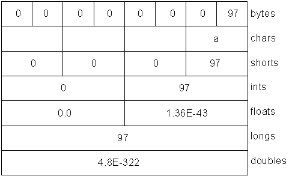
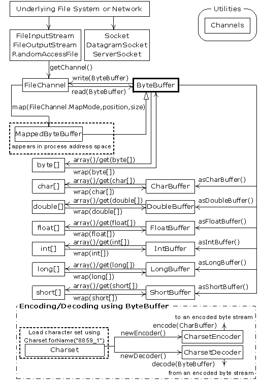
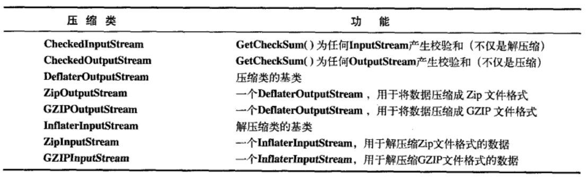

==========
输入和输出
==========

作者在这一章的描述，看起来像是在教我们如何使用工具，但是本章中涉及到很多类。
如果你没有捋清楚它们之间的关系，看起来还是比较费劲。看着看着，可能就迷糊了。

因此，我们还是首先对类之间的关系做一下梳理。

.. hint:: 

    流，代表任何有能力产出数据的数据源对象或者是有能力接收数据的接收端对象。

    - InputStream 和 OutputStream 的派生类用来处理 **字节流**；
    - Reader 和 Writer 的派生类用来处理 **字符流**。

InputStream
------------

.. uml::

    @startuml

    abstract InputStream {
        abstract int read()
    }

    class ByteArrayInputStream
    class FileInputStream
    class FilterInputStream
    class ObjectInputStream
    class PipedInputStream
    class SequenceInputStream
    class StringBufferInputStream
    class DataInputStream
    class BufferedInputStream

    InputStream <|-- ByteArrayInputStream
    InputStream <|-- FileInputStream
    InputStream <|-- FilterInputStream
    InputStream <|-- ObjectInputStream
    PipedInputStream --|> InputStream
    SequenceInputStream --|> InputStream
    StringBufferInputStream --|> InputStream
    FilterInputStream <|-- DataInputStream
    FilterInputStream <|-- BufferedInputStream

    @enduml

OutputStream
-------------

.. uml::

    @startuml

    abstract OutputStream {
        abstract void write()
    }

    class ByteArrayOutputStream
    class FileOutputStream
    class FilterOutputStream
    class ObjectOutputStream
    class PipedOutputStream
    class DataOutputStream
    class BufferedOutputStream
    class PrintStream

    ByteArrayOutputStream --|> OutputStream
    OutputStream <|-- FileOutputStream
    OutputStream <|-- FilterOutputStream
    OutputStream <|-- ObjectOutputStream
    PipedOutputStream --|> OutputStream
    FilterOutputStream <|-- DataOutputStream
    FilterOutputStream <|-- BufferedOutputStream
    FilterOutputStream <|-- PrintStream
    
    @enduml

Reader
------

.. uml::

    @startuml

    abstract Reader {
        abstract int read()
        abstract void close()
    }

    class BufferedReader
    class CharArrayReader
    class FilterReader
    class InputStreamReader
    class PipedReader
    class StringReader
    class URLReader
    class FileReader

    Reader <|-- BufferedReader
    Reader <|-- CharArrayReader
    Reader <|-- FilterReader
    Reader <|-- InputStreamReader
    PipedReader --|> Reader
    StringReader --|> Reader
    URLReader --|> Reader
    InputStreamReader <|-- FileReader
    
    @enduml

.. hint:: InputStreamReader 可以把 InputStream 转化为 Reader

Writer
------

.. uml::

    @startuml

    abstract Writer {
        abstract int write()
        abstract void flush()
        abstract void close()
    }

    class BufferedWriter
    class CharArrayWriter
    class FilterWriter
    class OutputStreamWriter
    class PipedWriter
    class StringWriter

    Writer <|-- BufferedWriter
    Writer <|-- CharArrayWriter
    Writer <|-- FilterWriter
    Writer <|-- OutputStreamWriter
    PipedWriter --|> Writer
    StringWriter --|> Writer
    
    @enduml

.. hint:: OutputStreamWriter 可以把 OutputStream 转化为 Writer

文件读写的实用工具
------------------

目录列表器
~~~~~~~~~~

用于查看一个目录下有哪些文件，编译运行下面的代码：

- 如果不带参数，查看一个完整目录列表
- 如果带参数，可以用正则表达式来进行条件筛选。

下面代码中实现了接口的 ``accept()`` 方法。 ``DirFilter`` 这个类存在的唯一原因就是 ``accept()`` 方法，
目的是把 ``accept()`` 方法提供给 ``list()`` 使用，使 ``list()`` 可以回调 ``accept()``，进而以决定那些文件包含在列表中。

.. code-block:: java

    //: io/DirList.java
    // Display a directory listing using regular expressions.
    // {Args: "D.*\.java"}
    import java.util.regex.*;
    import java.io.*;
    import java.util.*;

    public class DirList {
        public static void main(String[] args) {
            File path = new File(".");
            String[] list;
            if(args.length == 0)
                list = path.list();
            else
                list = path.list(new DirFilter(args[0]));
            Arrays.sort(list, String.CASE_INSENSITIVE_ORDER);
            for(String dirItem : list)
                System.out.println(dirItem);
        }
    }

    class DirFilter implements FilenameFilter {
        private Pattern pattern;
        public DirFilter(String regex) {
            pattern = Pattern.compile(regex);
        }
        public boolean accept(File dir, String name) {
            return pattern.matcher(name).matches();
        }
    } /* Output:
    DirectoryDemo.java
    DirList.java
    DirList2.java
    DirList3.java
    *///:~

上面代码中的 ``DirFilter`` 类很适合用匿名内部类来实现，如下：

.. admonition:: DirList3.java
    :class: dropdown

    .. code-block:: java

        //: io/DirList3.java
        // Building the anonymous inner class "in-place."
        // {Args: "D.*\.java"}
        import java.util.regex.*;
        import java.io.*;
        import java.util.*;

        public class DirList3 {
            public static void main(final String[] args) {
                File path = new File(".");
                String[] list;
                if(args.length == 0)
                    list = path.list();
                else
                    list = path.list(new FilenameFilter() {
                        private Pattern pattern = Pattern.compile(args[0]);
                        public boolean accept(File dir, String name) {
                            return pattern.matcher(name).matches();
                        }
                    });
                Arrays.sort(list, String.CASE_INSENSITIVE_ORDER);
                for(String dirItem : list)
                    System.out.println(dirItem);
            }
        } /* Output:
        DirectoryDemo.java
        DirList.java
        DirList2.java
        DirList3.java
        *///:~

    .. hint:: 使用匿名内部类的方式不便于阅读，因此需要谨慎使用。

目录的检查及创建
~~~~~~~~~~~~~~~~

``File`` 对象也可以用来创建新的目录或尚不存在的完整的目录路径。

.. admonition:: MakeDirectories.java
    :class: dropdown

    .. code-block:: java

        //: io/MakeDirectories.java
        // Demonstrates the use of the File class to
        // create directories and manipulate files.
        // {Args: MakeDirectoriesTest}
        import java.io.*;

        public class MakeDirectories {
            private static void usage() {
                System.err.println(
                    "Usage:MakeDirectories path1 ...\n" +
                    "Creates each path\n" +
                    "Usage:MakeDirectories -d path1 ...\n" +
                    "Deletes each path\n" +
                    "Usage:MakeDirectories -r path1 path2\n" +
                    "Renames from path1 to path2");
                System.exit(1);
            }
            private static void fileData(File f) {
                System.out.println(
                    "Absolute path: " + f.getAbsolutePath() +
                    "\n Can read: " + f.canRead() +
                    "\n Can write: " + f.canWrite() +
                    "\n getName: " + f.getName() +
                    "\n getParent: " + f.getParent() +
                    "\n getPath: " + f.getPath() +
                    "\n length: " + f.length() +
                    "\n lastModified: " + f.lastModified());
                if(f.isFile())
                    System.out.println("It's a file");
                else if(f.isDirectory())
                    System.out.println("It's a directory");
            }
            public static void main(String[] args) {
                if(args.length < 1) usage();
                if(args[0].equals("-r")) {
                    if(args.length != 3) usage();
                    File
                        old = new File(args[1]),
                        rname = new File(args[2]);
                    old.renameTo(rname);
                    fileData(old);
                    fileData(rname);
                    return; // Exit main
                }
                int count = 0;
                boolean del = false;
                if(args[0].equals("-d")) {
                    count++;
                    del = true;
                }
                count--;
                while(++count < args.length) {
                    File f = new File(args[count]);
                    if(f.exists()) {
                        System.out.println(f + " exists");
                        if(del) {
                            System.out.println("deleting..." + f);
                            f.delete();
                        }
                    }
                    else { // Doesn't exist
                        if(!del) {
                            f.mkdirs();
                            System.out.println("created " + f);
                        }
                    }
                    fileData(f);
                }
            }
        } /* Output: (80% match)
        created MakeDirectoriesTest
        Absolute path: d:\aaa-TIJ4\code\io\MakeDirectoriesTest
        Can read: true
        Can write: true
        getName: MakeDirectoriesTest
        getParent: null
        getPath: MakeDirectoriesTest
        length: 0
        lastModified: 1101690308831
        It's a directory
        *///:~

缓冲输入文件
~~~~~~~~~~~~

为了提高速度，我们希望使用缓冲读取文件。

.. code-block:: java
    :emphasize-lines: 14

    //: io/BufferedInputFile.java
    import java.io.*;

    public class BufferedInputFile {
        // Throw exceptions to console:
        public static String
        read(String filename) throws IOException {
            // Reading input by lines:
            BufferedReader in = new BufferedReader(
                new FileReader(filename));
            String s;
            StringBuilder sb = new StringBuilder();
            while((s = in.readLine())!= null)
                sb.append(s + "\n");
            in.close();
            return sb.toString();
        }
        public static void main(String[] args)
        throws IOException {
            System.out.print(read("BufferedInputFile.java"));
        }
    } /* (Execute to see output) *///:~

注意，第 14 行必须添加换行符，因为 ``readLine()`` 已将它们删掉。

读取文件
~~~~~~~~

读取文件可以使用多种方式：

- 使用 ``StringReader`` （字符流方式）
- 使用 ``ByteArrayInputStream`` （字节流方式）

字符流方式如下：

.. code-block:: java
    :emphasize-lines: 11

    //: io/MemoryInput.java
    import java.io.*;

    public class MemoryInput {
        public static void main(String[] args)
        throws IOException {
            StringReader in = new StringReader(
                BufferedInputFile.read("MemoryInput.java"));
            int c;
            while((c = in.read()) != -1)
                System.out.print((char)c);
        }
    } /* (Execute to see output) *///:~

注意，第 11 行 ``read()`` 是以 int 形式返回下一字节，因此必须转型为 char 才能正确打印。

字节流方式如下：

.. code-block:: java
    :emphasize-lines: 12

    //: io/FormattedMemoryInput.java
    import java.io.*;

    public class FormattedMemoryInput {
        public static void main(String[] args)
        throws IOException {
            try {
                DataInputStream in = new DataInputStream(
                    new ByteArrayInputStream(
                    BufferedInputFile.read(
                        "FormattedMemoryInput.java").getBytes()));
                while(true)
                    System.out.print((char)in.readByte());
            } catch(EOFException e) {
                System.err.println("End of stream");
            }
        }
    } /* (Execute to see output) *///:~

注意，第 12 行代码，是用异常来终止循环的。因为对于 ``readByte()`` 方法来讲，任何字节的值都是合法的结果，返回值不能用来检测输入是否结束。

或者一次一个字节第读取文件：

.. code-block:: java
    :emphasize-lines: 11

    //: io/TestEOF.java
    // Testing for end of file while reading a byte at a time.
    import java.io.*;

    public class TestEOF {
        public static void main(String[] args)
        throws IOException {
            DataInputStream in = new DataInputStream(
                new BufferedInputStream(
                    new FileInputStream("TestEOF.java")));
            while(in.available() != 0)
                System.out.print((char)in.readByte());
        }
    } /* (Execute to see output) *///:~

注意，第 11 行代码，没有用异常来终止循环，而是用 ``available()`` 来检测可供提取的字符数的。

输出到文件
~~~~~~~~~~

首先，创建一个与指定文件连接的 ``FileWriter``，通常，我们会用 ``BufferedWriter`` 将其包装起来用以缓冲输出。
在本例中，为了提供格式化机制，它被装饰成了 ``PrintWriter``。按照这种方式创建的数据文件可以作为普通文本文件读取。

.. code-block:: java
    :emphasize-lines: 17

    //: io/BasicFileOutput.java
    import java.io.*;

    public class BasicFileOutput {
        static String file = "BasicFileOutput.out";
        public static void main(String[] args)
        throws IOException {
            BufferedReader in = new BufferedReader(
                new StringReader(
                    BufferedInputFile.read("BasicFileOutput.java")));
            PrintWriter out = new PrintWriter(
                new BufferedWriter(new FileWriter(file)));
            int lineCount = 1;
            String s;
            while((s = in.readLine()) != null )
                out.println(lineCount++ + ": " + s);
            out.close();
            // Show the stored file:
            System.out.println(BufferedInputFile.read(file));
        }
    } /* (Execute to see output) *///:~

我们看到要为 out 显式调用 ``close()``。如果我们不为所有的输出文件调用 ``close()``，就会发现缓冲区内容不会被刷新清空，那么它们也就不完整。

读写随机访问文件
~~~~~~~~~~~~~~~~

使用 RandomAccessFile 利用 ``seek()`` 可以在文件中到处移动，并修改文件中的某个值。在使用 RandomAccessFile 时，你必须知道文件排版，这样才能正确操作它。
RandomAccessFile 拥有读取基本类型和 UTF-8 字符串的各种具体方法。

.. code-block:: java
    :emphasize-lines: 23

    //: io/UsingRandomAccessFile.java
    import java.io.*;

    public class UsingRandomAccessFile {
        static String file = "rtest.dat";
        static void display() throws IOException {
            RandomAccessFile rf = new RandomAccessFile(file, "r");
            for(int i = 0; i < 7; i++)
                System.out.println(
                    "Value " + i + ": " + rf.readDouble());
            System.out.println(rf.readUTF());
            rf.close();
        }
        public static void main(String[] args)
        throws IOException {
            RandomAccessFile rf = new RandomAccessFile(file, "rw");
            for(int i = 0; i < 7; i++)
                rf.writeDouble(i*1.414);
            rf.writeUTF("The end of the file");
            rf.close();
            display();
            rf = new RandomAccessFile(file, "rw");
            rf.seek(5*8);
            rf.writeDouble(47.0001);
            rf.close();
            display();
        }
    } /* Output:
    Value 0: 0.0
    Value 1: 1.414
    Value 2: 2.828
    Value 3: 4.242
    Value 4: 5.656
    Value 5: 7.069999999999999
    Value 6: 8.484
    The end of the file
    Value 0: 0.0
    Value 1: 1.414
    Value 2: 2.828
    Value 3: 4.242
    Value 4: 5.656
    Value 5: 47.0001
    Value 6: 8.484
    The end of the file
    *///:~

注意，第 23 行，因为 double 总是 8 字节长，所以为了用 ``seek()`` 查找第 5 个双精度值，你只需用 5*8 来产生查找位置。

读取二进制文件
~~~~~~~~~~~~~~

.. code-block:: java

    //: net/mindview/util/BinaryFile.java
    // Utility for reading files in binary form.
    package net.mindview.util;
    import java.io.*;

    public class BinaryFile {
        public static byte[] read(File bFile) throws IOException{
            BufferedInputStream bf = new BufferedInputStream(
                new FileInputStream(bFile));
            try {
                byte[] data = new byte[bf.available()];
                bf.read(data);
                return data;
            } finally {
                bf.close();
            }
        }
        public static byte[] read(String bFile) throws IOException {
            return read(new File(bFile).getAbsoluteFile());
        }
    } ///:~

标准 I/O
---------

从标准输入中读取
~~~~~~~~~~~~~~~~

- ``System.out`` 和 ``System.err`` 已经被包装成了 PrintStream
- ``System.in`` 没有经过包装

这意味着我们可以立即使用 ``System.out`` 和 ``System.err`` 但是在读取 ``System.in`` 之前必须对其进行包装。

通常我们会用 ``readLine()`` 一次一行地读取输入，为此，我们将 ``System.in`` 包装成 ``BufferedReader`` 来使用。
这要求我们必须用 ``InputStreamReader`` 把 ``System.in`` 转换为 ``Reader``。

.. code-block:: java

    //: io/Echo.java
    // How to read from standard input.
    // {RunByHand}
    import java.io.*;

    public class Echo {
        public static void main(String[] args)
        throws IOException {
            BufferedReader stdin = new BufferedReader(
                new InputStreamReader(System.in));
            String s;
            while((s = stdin.readLine()) != null && s.length()!= 0)
                System.out.println(s);
            // An empty line or Ctrl-Z terminates the program
        }
    } ///:~

.. note:: 文中多次提到 "包装" 这个概念，最简单直接的理解就是：把一个类或对象传入外层类的构造器。

将 System.out 转换成 PrintWriter
~~~~~~~~~~~~~~~~~~~~~~~~~~~~~~~~~

跟类型转换很像，在外层用对象的构造器包裹一下。

.. code-block:: java

    //: io/ChangeSystemOut.java
    // Turn System.out into a PrintWriter.
    import java.io.*;

    public class ChangeSystemOut {
        public static void main(String[] args) {
            PrintWriter out = new PrintWriter(System.out, true);
            out.println("Hello, world");
        }
    } /* Output:
    Hello, world
    *///:~

标准 I/O 重定向
~~~~~~~~~~~~~~~

.. code-block:: java
    :emphasize-lines: 14-16

    //: io/Redirecting.java
    // Demonstrates standard I/O redirection.
    import java.io.*;

    public class Redirecting {
        public static void main(String[] args)
        throws IOException {
            PrintStream console = System.out;
            BufferedInputStream in = new BufferedInputStream(
                new FileInputStream("Redirecting.java"));
            PrintStream out = new PrintStream(
                new BufferedOutputStream(
                    new FileOutputStream("test.out")));
            System.setIn(in);
            System.setOut(out);
            System.setErr(out);
            BufferedReader br = new BufferedReader(
                new InputStreamReader(System.in));
            String s;
            while((s = br.readLine()) != null)
                System.out.println(s);
            out.close(); // Remember this!
            System.setOut(console);
        }
    } ///:~

注意，程序开头处存储了对最初 ``System.out`` 对象的引用，并且在结尾处将系统输出恢复到了该对象上。

I/O 重定向操纵的是字节流，而不是字符流，因此我们使用的是 ``InputStream`` 和 ``OutputStream`` 而不是 ``Reader`` 和 ``Writer``。

进程控制
--------

进程控制常见的任务是：我们想在程序中执行命令行，并把结果打印出来。

要想运行一个程序，只需要向 ``OSExecute.command()`` 传递一个 command 字符串，它与以在控制台上运行该程序所键入的命令相同。

.. code-block:: java

    //: net/mindview/util/OSExecute.java
    // Run an operating system command
    // and send the output to the console.
    package net.mindview.util;
    import java.io.*;

    public class OSExecute {
        public static void command(String command) {
            boolean err = false;
            try {
                Process process =
                    new ProcessBuilder(command.split(" ")).start();
                BufferedReader results = new BufferedReader(
                    new InputStreamReader(process.getInputStream()));
                String s;
                while((s = results.readLine())!= null)
                    System.out.println(s);
                BufferedReader errors = new BufferedReader(
                    new InputStreamReader(process.getErrorStream()));
                // Report errors and return nonzero value
                // to calling process if there are problems:
                while((s = errors.readLine())!= null) {
                    System.err.println(s);
                    err = true;
                }
            } catch(Exception e) {
                // Compensate for Windows 2000, which throws an
                // exception for the default command line:
                if(!command.startsWith("CMD /C"))
                    command("CMD /C " + command);
                else
                    throw new RuntimeException(e);
            }
            if(err)
                throw new OSExecuteException("Errors executing " +
                    command);
        }
    } ///:~

下面的代码段展示如何使用上面的代码段：

.. code-block:: java

    //: io/OSExecuteDemo.java
    // Demonstrates standard I/O redirection.
    import net.mindview.util.*;

    public class OSExecuteDemo {
        public static void main(String[] args) {
            OSExecute.command("javap OSExecuteDemo");
        }
    } /* Output:
    Compiled from "OSExecuteDemo.java"
    public class OSExecuteDemo extends java.lang.Object{
            public OSExecuteDemo();
            public static void main(java.lang.String[]);
    }
    *///:~

注意，这里的异常是自定义的：

.. code-block:: java

    //: net/mindview/util/OSExecuteException.java
    package net.mindview.util;

    public class OSExecuteException extends RuntimeException {
        public OSExecuteException(String why) { super(why); }
    } ///:~

新 I/O
-------

目的在于提高速度。速度的提高来自于所使用的结构更接近于操作系统执行 I/O 的方式：通道和缓冲器。

- 唯一直接与通道交互的缓冲器是 ``ByteBuffer``；
- ``Reader`` 和 ``Writer`` 这种字符模式类不能用于产生通道；
- ``java.nio.channels.Channels`` 可以在通道中产生 ``Reader`` 和 ``Writer``。

通道是一个相当基础的东西：可以向它传送用于读写的 ``ByteBuffer``，并且可以锁定文件的某些区域用于独占式访问。

.. _create-channel:

创建通道
~~~~~~~~

下面的代码创建了三种类型的通道：1、可写；2、可读可写；3、可读。

.. code-block:: java

    //: io/GetChannel.java
    // Getting channels from streams
    import java.nio.*;
    import java.nio.channels.*;
    import java.io.*;

    public class GetChannel {
        private static final int BSIZE = 1024;
        public static void main(String[] args) throws Exception {
            // Write a file:
            FileChannel fc =
                new FileOutputStream("data.txt").getChannel();
            fc.write(ByteBuffer.wrap("Some text ".getBytes()));
            fc.close();
            // Add to the end of the file:
            fc =
                new RandomAccessFile("data.txt", "rw").getChannel();
            fc.position(fc.size()); // Move to the end
            fc.write(ByteBuffer.wrap("Some more".getBytes()));
            fc.close();
            // Read the file:
            fc = new FileInputStream("data.txt").getChannel();
            ByteBuffer buff = ByteBuffer.allocate(BSIZE);
            fc.read(buff);
            buff.flip();
            while(buff.hasRemaining())
                System.out.print((char)buff.get());
        }
    } /* Output:
    Some text Some more
    *///:~

- ``getChannel()`` 会产生一个 ``FileChannel``；
- ``warp()`` 将已存在的字节数组 "包装" 到 ``ByteBuffer`` 中，也可以使用 ``put()`` 方法填充 ``ByteBuffer``；
- 对于只读访问，必须显式地使用静态的 ``allocate()`` 方法来分配 ``ByteBuffer``；
- 一旦调用 ``read()`` 来告知 ``FileChannel`` 向 ``ByteBuffer`` 存储字节，就必须调用缓冲器上的 ``flip()``；
- ``flip()`` 用于准备从缓冲区读取已经写入的数据。

用通道复制文件
~~~~~~~~~~~~~~

.. code-block:: java

    //: io/ChannelCopy.java
    // Copying a file using channels and buffers
    // {Args: ChannelCopy.java test.txt}
    import java.nio.*;
    import java.nio.channels.*;
    import java.io.*;

    public class ChannelCopy {
        private static final int BSIZE = 1024;
        public static void main(String[] args) throws Exception {
            if(args.length != 2) {
                System.out.println("arguments: sourcefile destfile");
                System.exit(1);
            }
            FileChannel
                in = new FileInputStream(args[0]).getChannel(),
                out = new FileOutputStream(args[1]).getChannel();
            ByteBuffer buffer = ByteBuffer.allocate(BSIZE);
            while(in.read(buffer) != -1) {
                buffer.flip(); // Prepare for writing
                out.write(buffer);
                buffer.clear();    // Prepare for reading
            }
        }
    } ///:~

更理想的方式是使用方法 transferTo() 和 transferFrom() 将通道直接相连：

.. code-block:: java

    //: io/TransferTo.java
    // Using transferTo() between channels
    // {Args: TransferTo.java TransferTo.txt}
    import java.nio.channels.*;
    import java.io.*;

    public class TransferTo {
        public static void main(String[] args) throws Exception {
            if(args.length != 2) {
                System.out.println("arguments: sourcefile destfile");
                System.exit(1);
            }
            FileChannel
                in = new FileInputStream(args[0]).getChannel(),
                out = new FileOutputStream(args[1]).getChannel();
            in.transferTo(0, in.size(), out);
            // Or:
            // out.transferFrom(in, 0, in.size());
        }
    } ///:~

转换数据
~~~~~~~~

在小节 :ref:`create-channel` 中，使用 ByteBuffer 来缓存数据，同样地，也可以用 CharBuffer 来缓存数据。
但是，它并不能正常工作，需要我们做一些转换工作。

.. admonition:: BufferToText.java
    :class: dropdown

    .. code-block:: java
        :emphasize-lines: 20, 23

        //: io/BufferToText.java
        // Converting text to and from ByteBuffers
        import java.nio.*;
        import java.nio.channels.*;
        import java.nio.charset.*;
        import java.io.*;

        public class BufferToText {
            private static final int BSIZE = 1024;
            public static void main(String[] args) throws Exception {
                FileChannel fc =
                    new FileOutputStream("data2.txt").getChannel();
                fc.write(ByteBuffer.wrap("Some text".getBytes()));
                fc.close();
                fc = new FileInputStream("data2.txt").getChannel();
                ByteBuffer buff = ByteBuffer.allocate(BSIZE);
                fc.read(buff);
                buff.flip();
                // Doesn't work:
                System.out.println(buff.asCharBuffer());
                // Decode using this system's default Charset:
                buff.rewind();
                String encoding = System.getProperty("file.encoding");
                System.out.println("Decoded using " + encoding + ": "
                    + Charset.forName(encoding).decode(buff));
                // Or, we could encode with something that will print:
                fc = new FileOutputStream("data2.txt").getChannel();
                fc.write(ByteBuffer.wrap(
                    "Some text".getBytes("UTF-16BE")));
                fc.close();
                // Now try reading again:
                fc = new FileInputStream("data2.txt").getChannel();
                buff.clear();
                fc.read(buff);
                buff.flip();
                System.out.println(buff.asCharBuffer());
                // Use a CharBuffer to write through:
                fc = new FileOutputStream("data2.txt").getChannel();
                buff = ByteBuffer.allocate(24); // More than needed
                buff.asCharBuffer().put("Some text");
                fc.write(buff);
                fc.close();
                // Read and display:
                fc = new FileInputStream("data2.txt").getChannel();
                buff.clear();
                fc.read(buff);
                buff.flip();
                System.out.println(buff.asCharBuffer());
            }
        } /* Output:
        ????
        Decoded using Cp1252: Some text
        Some text
        Some text
        *///:~

缓冲器容纳的是普通的字节，为了把它们转换成字符：

- 要么在输入时对其进行编码
- 要么在输出时对其解码

可以使用 ``java.nio.charset.Charset`` 类实现这些功能。

获取基本类型
~~~~~~~~~~~~

尽管 ``ByteBuffer`` 只能保存字节类型的数据，但是它具有从其所容纳的字节中产生出各种不同基本类型值的方法。

向 ``ByteBuffer`` 插入基本类型数据的最简单的方法是：

- 利用 ``asCharBuffer()`` 、 ``asShortBuffer()`` 等获得该缓冲器上的视图；
- 使用视图的 ``put()`` 方法
  
注意到，使用 ``ShortBuffer`` 的 ``put()`` 方法时，需要类型转换。

.. code-block:: java

    //: io/GetData.java
    // Getting different representations from a ByteBuffer
    import java.nio.*;
    import static net.mindview.util.Print.*;

    public class GetData {
        private static final int BSIZE = 1024;
        public static void main(String[] args) {
            ByteBuffer bb = ByteBuffer.allocate(BSIZE);
            // Allocation automatically zeroes the ByteBuffer:
            int i = 0;
            while(i++ < bb.limit())
                if(bb.get() != 0)
                    print("nonzero");
            print("i = " + i);
            bb.rewind();
            // Store and read a char array:
            bb.asCharBuffer().put("Howdy!");
            char c;
            while((c = bb.getChar()) != 0)
                printnb(c + " ");
            print();
            bb.rewind();
            // Store and read a short:
            bb.asShortBuffer().put((short)471142);
            print(bb.getShort());
            bb.rewind();
            // Store and read an int:
            bb.asIntBuffer().put(99471142);
            print(bb.getInt());
            bb.rewind();
            // Store and read a long:
            bb.asLongBuffer().put(99471142);
            print(bb.getLong());
            bb.rewind();
            // Store and read a float:
            bb.asFloatBuffer().put(99471142);
            print(bb.getFloat());
            bb.rewind();
            // Store and read a double:
            bb.asDoubleBuffer().put(99471142);
            print(bb.getDouble());
            bb.rewind();
        }
    } /* Output:
    i = 1025
    H o w d y !
    12390
    99471142
    99471142
    9.9471144E7
    9.9471142E7
    *///:~

视图缓冲器
~~~~~~~~~~

视图缓冲器可以让我们通过某个特定的基本类型的视窗查看其底层的 ``ByteBuffer``。
``ByteBuffer`` 依然是实际存储数据的地方，"支持" 着前面的视图，因此，对视图的任何修改，
都会映射成为对 ``ByteBuffer`` 中数据的修改。

下面的例子，用 ``IntBuffer`` 操纵 ``ByteBuffer`` 中的 ``int`` 型数据。

.. code-block:: java

    //: io/IntBufferDemo.java
    // Manipulating ints in a ByteBuffer with an IntBuffer
    import java.nio.*;

    public class IntBufferDemo {
        private static final int BSIZE = 1024;
        public static void main(String[] args) {
            ByteBuffer bb = ByteBuffer.allocate(BSIZE);
            IntBuffer ib = bb.asIntBuffer();
            // Store an array of int:
            ib.put(new int[]{ 11, 42, 47, 99, 143, 811, 1016 });
            // Absolute location read and write:
            System.out.println(ib.get(3));
            ib.put(3, 1811);
            // Setting a new limit before rewinding the buffer.
            ib.flip();
            while(ib.hasRemaining()) {
                int i = ib.get();
                System.out.println(i);
            }
        }
    } /* Output:
    99
    11
    42
    47
    1811
    143
    811
    1016
    *///:~

一旦底层的 ``ByteBuffer`` 通过视图缓冲器填满了整数或其他基本类型时，就可以直接写到通道中了。

下面的例子通过在同一个 ``ByteBuffer`` 上建立不同的视图缓冲器，将同一字节序列翻译成了其他基本类型。

.. code-block:: java

    //: io/ViewBuffers.java
    import java.nio.*;
    import static net.mindview.util.Print.*;

    public class ViewBuffers {
        public static void main(String[] args) {
            ByteBuffer bb = ByteBuffer.wrap(
                new byte[]{ 0, 0, 0, 0, 0, 0, 0, 'a' });
            bb.rewind();
            printnb("Byte Buffer ");
            while(bb.hasRemaining())
                printnb(bb.position()+ " -> " + bb.get() + ", ");
            print();
            CharBuffer cb =
                ((ByteBuffer)bb.rewind()).asCharBuffer();
            printnb("Char Buffer ");
            while(cb.hasRemaining())
                printnb(cb.position() + " -> " + cb.get() + ", ");
            print();
            FloatBuffer fb =
                ((ByteBuffer)bb.rewind()).asFloatBuffer();
            printnb("Float Buffer ");
            while(fb.hasRemaining())
                printnb(fb.position()+ " -> " + fb.get() + ", ");
            print();
            IntBuffer ib =
                ((ByteBuffer)bb.rewind()).asIntBuffer();
            printnb("Int Buffer ");
            while(ib.hasRemaining())
                printnb(ib.position()+ " -> " + ib.get() + ", ");
            print();
            LongBuffer lb =
                ((ByteBuffer)bb.rewind()).asLongBuffer();
            printnb("Long Buffer ");
            while(lb.hasRemaining())
                printnb(lb.position()+ " -> " + lb.get() + ", ");
            print();
            ShortBuffer sb =
                ((ByteBuffer)bb.rewind()).asShortBuffer();
            printnb("Short Buffer ");
            while(sb.hasRemaining())
                printnb(sb.position()+ " -> " + sb.get() + ", ");
            print();
            DoubleBuffer db =
                ((ByteBuffer)bb.rewind()).asDoubleBuffer();
            printnb("Double Buffer ");
            while(db.hasRemaining())
                printnb(db.position()+ " -> " + db.get() + ", ");
        }
    } /* Output:
    Byte Buffer 0 -> 0, 1 -> 0, 2 -> 0, 3 -> 0, 4 -> 0, 5 -> 0, 6 -> 0, 7 -> 97,
    Char Buffer 0 ->    , 1 ->    , 2 ->    , 3 -> a,
    Float Buffer 0 -> 0.0, 1 -> 1.36E-43,
    Int Buffer 0 -> 0, 1 -> 97,
    Long Buffer 0 -> 97,
    Short Buffer 0 -> 0, 1 -> 0, 2 -> 0, 3 -> 97,
    Double Buffer 0 -> 4.8E-322,
    *///:~

注意， ``ByteBuffer`` 通过一个被 "包装" 过的 8 字节数组产生，然后通过各种不同的基本类型的视图缓冲器显示了出来。
在下图中可以看到，当从不同类型的缓冲器读取时，数据显示的方式也不同。这与上面的程序相对应。

用缓冲器操纵数据
~~~~~~~~~~~~~~~~

如果想把一个字节的数据写入到文件：

- 首先用 ``ByteBuffer.wrap()`` 把字节数组包装起来；
- 然后用 ``getChannel()`` 在 ``FileOutputStream`` 上打开一个通道；
- 最后，将来自于 ``ByteBuffer`` 的数据写到 ``FileChannel`` 中。

参考下面的流程图：

内存映射文件
~~~~~~~~~~~~

内存映射文件允许我们创建和修改那些因为太大而不能放入内存的文件。

.. code-block:: java

    //: io/LargeMappedFiles.java
    // Creating a very large file using mapping.
    // {RunByHand}
    import java.nio.*;
    import java.nio.channels.*;
    import java.io.*;
    import static net.mindview.util.Print.*;

    public class LargeMappedFiles {
        static int length = 0x8FFFFFF; // 128 MB
        public static void main(String[] args) throws Exception {
            MappedByteBuffer out =
                new RandomAccessFile("test.dat", "rw").getChannel()
                .map(FileChannel.MapMode.READ_WRITE, 0, length);
            for(int i = 0; i < length; i++)
                out.put((byte)'x');
            print("Finished writing");
            for(int i = length/2; i < length/2 + 6; i++)
                printnb((char)out.get(i));
        }
    } ///:~

为了既能读又能写，先由 ``RandomAccessFile`` 开始，获得该文件上的通道，然后调用 ``map()`` 产生 ``MappedByteBuffer``，这是一种特殊类型的直接缓冲器。

注意，我们必须指定映射文件的初始位置和映射区域长度，这意味着我们可以映射某个大文件的较小部分。

``MappedByteBuffer`` 继承自 ``ByteBuffer``，因此它具有 ``ByteBuffer`` 的所有方法，这里我们只用了 ``put()`` 和 ``get()``。

实质上，只有一部分文件载入了内存，其他部分被交换了出去，用这种方式，很大的文件（可达 2GB）也可以很容易地修改。

底层操作系统的文件映射工具用来最大化地提高性能。

文件加锁
~~~~~~~~

文件锁对其他的操作系统进程是可见的，因为 Java 的文件加锁直接映射到了本地操作系统的加锁工具。

.. code-block:: java

    //: io/FileLocking.java
    import java.nio.channels.*;
    import java.util.concurrent.*;
    import java.io.*;

    public class FileLocking {
        public static void main(String[] args) throws Exception {
            FileOutputStream fos= new FileOutputStream("file.txt");
            FileLock fl = fos.getChannel().tryLock();
            if(fl != null) {
                System.out.println("Locked File");
                TimeUnit.MILLISECONDS.sleep(100);
                fl.release();
                System.out.println("Released Lock");
            }
            fos.close();
        }
    } /* Output:
    Locked File
    Released Lock
    *///:~

注意，通过对 ``FileChannel`` 调用 ``tryLock()`` 或 ``lock()`` 就可以获得整个文件的 ``FileLock``。

- ``tryLock()`` 是非阻塞式的，如果不能获得，他将直接从方法调用返回；
- ``lock()`` 是阻塞式的，它会阻塞进程直到获得锁。

锁的类型（共享或独占）可以通过 ``FileLock.isShared()`` 来查询。

.. hint:: 

    ``SocketChannel`` 、 ``DatagramChannel`` 、 ``ServerSocketChannel`` 不需要加锁，因为它们是从单进程实体继承而来，
    我们通常不在两个进程之间共享网络 socket。

映射文件部分加锁
~~~~~~~~~~~~~~~~

文件映射通常用于极大的文件，部分加锁后，文件的其他部分仍可用于共享。比如，数据库就是这样，因此多个用户可以同时访问它。

.. code-block:: java

    //: io/LockingMappedFiles.java
    // Locking portions of a mapped file.
    // {RunByHand}
    import java.nio.*;
    import java.nio.channels.*;
    import java.io.*;

    public class LockingMappedFiles {
        static final int LENGTH = 0x8FFFFFF; // 128 MB
        static FileChannel fc;
        public static void main(String[] args) throws Exception {
            fc =
                new RandomAccessFile("test.dat", "rw").getChannel();
            MappedByteBuffer out =
                fc.map(FileChannel.MapMode.READ_WRITE, 0, LENGTH);
            for(int i = 0; i < LENGTH; i++)
                out.put((byte)'x');
            new LockAndModify(out, 0, 0 + LENGTH/3);
            new LockAndModify(out, LENGTH/2, LENGTH/2 + LENGTH/4);
        }
        private static class LockAndModify extends Thread {
            private ByteBuffer buff;
            private int start, end;
            LockAndModify(ByteBuffer mbb, int start, int end) {
                this.start = start;
                this.end = end;
                mbb.limit(end);
                mbb.position(start);
                buff = mbb.slice();
                start();
            }
            public void run() {
                try {
                    // Exclusive lock with no overlap:
                    FileLock fl = fc.lock(start, end, false);
                    System.out.println("Locked: "+ start +" to "+ end);
                    // Perform modification:
                    while(buff.position() < buff.limit() - 1)
                        buff.put((byte)(buff.get() + 1));
                    fl.release();
                    System.out.println("Released: "+start+" to "+ end);
                } catch(IOException e) {
                    throw new RuntimeException(e);
                }
            }
        }
    } ///:~

压缩
----

Java I/O 类库中的类支持读写压缩格式的数据流。你可以用它们对其他的 I/O 类进行封装，以提供压缩功能。后面用到时再补充这部分知识。

对象序列化
----------

利用对象的序列化，可以实现轻量级持久性。
"持久性" 意味着一个对象的生存周期并不取决于程序是否正在运行，它可以生存于程序的调用之间。
通过将一个序列化对象写入磁盘，然后在重新调用程序时恢复该对象，就能够实现持久性的效果。

之所以称之为 "轻量级"，是因为不能用某种 "persistent" 关键字来简单定义一个对象，由操作系统自动维护其他细节。
我们必须在程序中显式地序列化和反序列化。如果需要一个更加严格的持久化机制，可以考虑使用 Hibernate 之类的工具。

对象序列化的概念加入到语言中是为了支持两种主要特性：

- 远程方法调用
- 应 Java Beans 需要

Java 的对象序列化将那些实现了 ``Serializable``
接口的对象转换成一个字节序列，并能够在以后将这个字节序列完全恢复为原来的对象。

这一过程甚至可通过网络进行，这意味着序列化机制能自动弥补不同操作系统之间的差异。
也就是说，可以在运行 Windwos 系统的计算机上创建一个对象，将其序列化，
通过网络将它发送给一台运行 Unix 系统的计算机，然后在那里准确地重新组装，
而不用担心数据在不同机器上的表示会不同，也不必关心字节的顺序或者其他任何细节。

Java 中可以序列化的对象包括：

- 所有基本类型的封装器
- 所有容器类
- Class 对象

对象序列化的过程：

- 创建 ``OutputStream`` 对象（因为对象序列化是基于字节的）
- 将其封装在 ``ObjectOutputStream`` 对象内
- 调用 ``writeObject()`` 即可将对象序列化，并将其发送给 ``OutputStream``

对象反序列化的过程：

- 创建 ``InputStream`` 对象
- 将其封装在 ``ObjectInputStream`` 对象内
- 调用 ``readObject()`` 

例如，尝试将一个对象序列化和反序列化。

.. code-block:: java

    //: io/Alien.java
    // A serializable class.
    import java.io.*;
    public class Alien implements Serializable {} ///:~

序列化：

.. code-block:: java

    //: io/FreezeAlien.java
    // Create a serialized output file.
    import java.io.*;

    public class FreezeAlien {
        public static void main(String[] args) throws Exception {
            ObjectOutput out = new ObjectOutputStream(
                new FileOutputStream("X.file"));
            Alien quellek = new Alien();
            out.writeObject(quellek);
        }
    } ///:~

反序列化：

.. code-block:: java

    //: io/xfiles/ThawAlien.java
    // Try to recover a serialized file without the
    // class of object that's stored in that file.
    // {RunByHand}
    import java.io.*;

    public class ThawAlien {
        public static void main(String[] args) throws Exception {
            ObjectInputStream in = new ObjectInputStream(
                new FileInputStream(new File("..", "X.file")));
            Object mystery = in.readObject();
            System.out.println(mystery.getClass());
        }
    } /* Output:
    class Alien
    *///:~

序列化的控制
~~~~~~~~~~~~

有时，我们不想让特定子对象序列化，比如敏感信息（密码）。即使对象中的这些信息时 ``private``，
一经序列化处理，人们就可以通过读取文件或者拦截网络传输来访问它。

将类实现为 ``Externalizable`` 时，没有任何东西可以自动序列化，并且可以在 ``writeExternal()`` 内部只对所需部分显式序列化。

``Externalizable`` 接口继承了 ``Serializable`` 接口，同时添加了两个方法： ``writeExternal()``
和 ``readExternal()``。这两个方法在序列化和反序列化的过程中被自动调用。

演示代码如下所示：

.. admonition:: Blips.java
    :class: dropdown

    .. code-block:: java

        //: io/Blips.java
        // Simple use of Externalizable & a pitfall.
        import java.io.*;
        import static net.mindview.util.Print.*;

        class Blip1 implements Externalizable {
            public Blip1() {
                print("Blip1 Constructor");
            }
            public void writeExternal(ObjectOutput out)
                    throws IOException {
                print("Blip1.writeExternal");
            }
            public void readExternal(ObjectInput in)
                throws IOException, ClassNotFoundException {
                print("Blip1.readExternal");
            }
        }

        class Blip2 implements Externalizable {
            Blip2() {
                print("Blip2 Constructor");
            }
            public void writeExternal(ObjectOutput out)
                    throws IOException {
                print("Blip2.writeExternal");
            }
            public void readExternal(ObjectInput in)
                throws IOException, ClassNotFoundException {
                print("Blip2.readExternal");
            }
        }

        public class Blips {
            public static void main(String[] args)
            throws IOException, ClassNotFoundException {
                print("Constructing objects:");
                Blip1 b1 = new Blip1();
                Blip2 b2 = new Blip2();
                ObjectOutputStream o = new ObjectOutputStream(
                    new FileOutputStream("Blips.out"));
                print("Saving objects:");
                o.writeObject(b1);
                o.writeObject(b2);
                o.close();
                // Now get them back:
                ObjectInputStream in = new ObjectInputStream(
                    new FileInputStream("Blips.out"));
                print("Recovering b1:");
                b1 = (Blip1)in.readObject();
                // OOPS! Throws an exception:
        //! print("Recovering b2:");
        //! b2 = (Blip2)in.readObject();
            }
        } /* Output:
        Constructing objects:
        Blip1 Constructor
        Blip2 Constructor
        Saving objects:
        Blip1.writeExternal
        Blip2.writeExternal
        Recovering b1:
        Blip1 Constructor
        Blip1.readExternal
        *///:~

    .. note:: 
        
        Blip1 的构造器有 public 而 Blip2 没有。 b2 会有异常。
        
        - 恢复 ``Serializable`` 对象，对象完全以它存储的二进制位为基础来构造，不调用构造器
        - 恢复 ``Externalizable`` 对象，所有的普通的默认构造器都会被调用，然后调用 ``readExternal()``
            
transient（瞬时）关键字
~~~~~~~~~~~~~~~~~~~~~~~

如果我们操作的是 ``Serializable`` 对象，那么所有的序列化操作都会自动进行。
为了能够予以控制，可以用 ``transient`` 关键字逐个字段地关闭序列化。

比如，登陆网页时，保存数据但不包括密码。最简单的方式就是实现 ``Serializable``，将 ``password`` 字段标为 ``transient``。

.. code-block:: java
    :emphasize-lines: 11

    //: io/Logon.java
    // Demonstrates the "transient" keyword.
    import java.util.concurrent.*;
    import java.io.*;
    import java.util.*;
    import static net.mindview.util.Print.*;

    public class Logon implements Serializable {
        private Date date = new Date();
        private String username;
        private transient String password;
        public Logon(String name, String pwd) {
            username = name;
            password = pwd;
        }
        public String toString() {
            return "logon info: \n     username: " + username +
                "\n     date: " + date + "\n     password: " + password;
        }
        public static void main(String[] args) throws Exception {
            Logon a = new Logon("Hulk", "myLittlePony");
            print("logon a = " + a);
            ObjectOutputStream o = new ObjectOutputStream(
                new FileOutputStream("Logon.out"));
            o.writeObject(a);
            o.close();
            TimeUnit.SECONDS.sleep(1); // Delay
            // Now get them back:
            ObjectInputStream in = new ObjectInputStream(
                new FileInputStream("Logon.out"));
            print("Recovering object at " + new Date());
            a = (Logon)in.readObject();
            print("logon a = " + a);
        }
    } /* Output: (Sample)
    logon a = logon info:
        username: Hulk
        date: Sat Nov 19 15:03:26 MST 2005
        password: myLittlePony
    Recovering object at Sat Nov 19 15:03:28 MST 2005
    logon a = logon info:
        username: Hulk
        date: Sat Nov 19 15:03:26 MST 2005
        password: null
    *///:~

XML
---

对象序列化的一个重要限制是它只是 Java 的解决方案：只有 Java 程序才能反序列化这种对象。
将数据转换成 XML 格式后，这样才能被各种各样的平台和语言使用。

例如，假设有一个 Person 对象，它包含姓和名。

序列化：

.. code-block:: java

    //: xml/Person.java
    // Use the XOM library to write and read XML
    // {Requires: nu.xom.Node; You must install
    // the XOM library from http://www.xom.nu }
    import nu.xom.*;
    import java.io.*;
    import java.util.*;

    public class Person {
        private String first, last;
        public Person(String first, String last) {
            this.first = first;
            this.last = last;
        }
        // Produce an XML Element from this Person object:
        public Element getXML() {
            Element person = new Element("person");
            Element firstName = new Element("first");
            firstName.appendChild(first);
            Element lastName = new Element("last");
            lastName.appendChild(last);
            person.appendChild(firstName);
            person.appendChild(lastName);
            return person;
        }
        // Constructor to restore a Person from an XML Element:
        public Person(Element person) {
            first= person.getFirstChildElement("first").getValue();
            last = person.getFirstChildElement("last").getValue();
        }
        public String toString() { return first + " " + last; }
        // Make it human-readable:
        public static void
        format(OutputStream os, Document doc) throws Exception {
            Serializer serializer= new Serializer(os,"ISO-8859-1");
            serializer.setIndent(4);
            serializer.setMaxLength(60);
            serializer.write(doc);
            serializer.flush();
        }
        public static void main(String[] args) throws Exception {
            List<Person> people = Arrays.asList(
                new Person("Dr. Bunsen", "Honeydew"),
                new Person("Gonzo", "The Great"),
                new Person("Phillip J.", "Fry"));
            System.out.println(people);
            Element root = new Element("people");
            for(Person p : people)
                root.appendChild(p.getXML());
            Document doc = new Document(root);
            format(System.out, doc);
            format(new BufferedOutputStream(new FileOutputStream(
                "People.xml")), doc);
        }
    } /* Output:
    [Dr. Bunsen Honeydew, Gonzo The Great, Phillip J. Fry]
    <?xml version="1.0" encoding="ISO-8859-1"?>
    <people>
            <person>
                    <first>Dr. Bunsen</first>
                    <last>Honeydew</last>
            </person>
            <person>
                    <first>Gonzo</first>
                    <last>The Great</last>
            </person>
            <person>
                    <first>Phillip J.</first>
                    <last>Fry</last>
            </person>
    </people>
    *///:~

反序列化：

.. code-block:: java

    //: xml/People.java
    // {Requires: nu.xom.Node; You must install
    // the XOM library from http://www.xom.nu }
    // {RunFirst: Person}
    import nu.xom.*;
    import java.util.*;

    public class People extends ArrayList<Person> {
        public People(String fileName) throws Exception    {
            Document doc = new Builder().build(fileName);
            Elements elements =
                doc.getRootElement().getChildElements();
            for(int i = 0; i < elements.size(); i++)
                add(new Person(elements.get(i)));
        }
        public static void main(String[] args) throws Exception {
            People p = new People("People.xml");
            System.out.println(p);
        }
    } /* Output:
    [Dr. Bunsen Honeydew, Gonzo The Great, Phillip J. Fry]
    *///:~
