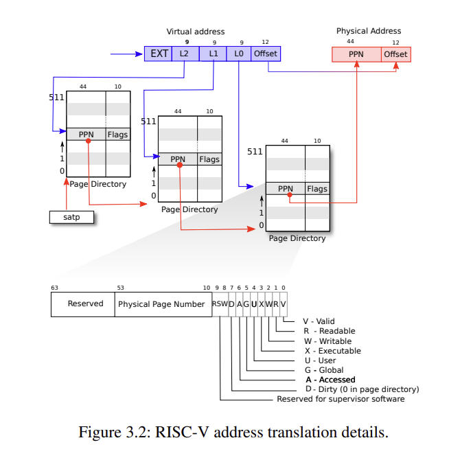
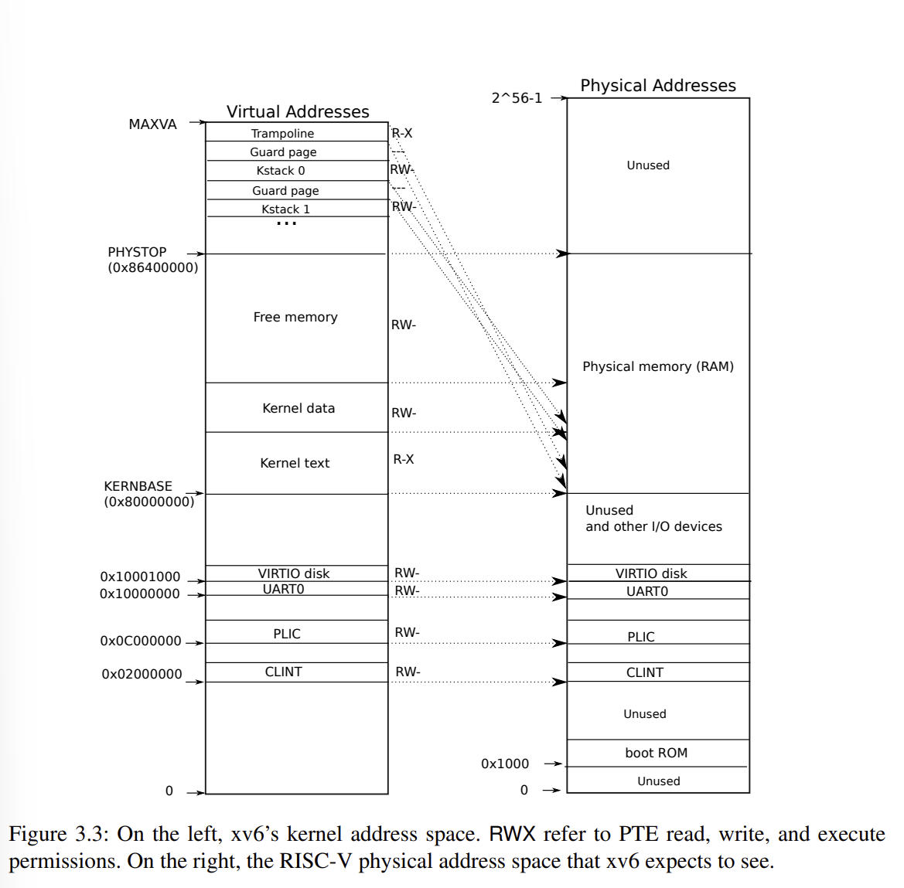

# 实验三：页表

## 打印一张页表

xv6 的前两个实验都很简单，相信大多数人都可以花点时间完成，但是从第三个实验开始，难度就开始急剧上升了。
页表是很重要的一章，也是新手练习 xv6 的瓶颈，好多人在这里就放弃了（包括我）。

要完成这个实验，我们首先要理解，xv6 的页表工作机制是怎么样的？根据这个实验的 hint，我们需要参考课程讲义中的 Chapter 3：
[book-riscv-rev1.pdf](https://pdos.csail.mit.edu/6.828/2020/xv6/book-riscv-rev1.pdf)

里面有一张很重要的图，是关于页表转换机制的，xv6 采用的是三级页表转换：

理解这个图，主要是理解它的计算规则：

- 通过 satp 定位到第一张页表的基地址（每个 CPU 都有自己的 satp 寄存器）
- 在第一张页表的基地址上偏移 L2 定位到第二张页表的基地址
- 在第二张页表的基地址上偏移 L1 定位到第三张页表的基地址
- 在第三张页表的基地址上偏移 L0 定位到存储数据的内存页的基地址
- 在内存页的基地址上偏移 Offset 定位到某个变量的物理地址

接下来，解释一下地址数据是怎么对齐的？

- 约定：PTE   的全称为 Page Table Entries，中文名页表项，每个页表项包含了一个 PPN 和 flags
- 约定：PPN 的全称为 Physical Page Number，中文名物理页号，物理页号占 44 位
- 约定：flags 标识下一级页表是否有效，当前页表中的数据是否可读可写，flags 占 10 位
- 不管是页表，还是内存页，都是 4096 字节（4096 = 212）
- 不管是物理地址，还是虚拟地址，都是 64 位的
- 因此，对于 64 位（8 字节）的机器，每个页表可以存储 512 个 PTE（4096 / 8 = 512）
- 因此，定位页表中的某个 PTE 需要 9 位（29 = 512）
- 虚拟地址，只使用了低 39 位（3 \* 9 + 12 = 39，偏移占 12 位）
- 物理地址，只使用了低 56 位（44 + 12 = 56）

在三级页表转换机制中，如果在某一级中发现，地址不存在，转换机构会抛出一个页表异常，然后内核会去处理这个异常。

接下来还有一个比较重要的，就是内核地址空间的结构，我们需要了解：

图 3.3 的左侧是 xv6 的内核地址。右侧是 RISC-V 物理硬件的实际地址。

我们希望通过操控内核地址，进而可以直接去读写真实的物理硬件，这也是内核地址空间存在的意义，将硬件抽象了，通过软件的方式可以读写硬件。

分析一下，xv6 的内核地址空间：

- 低于 0x80000000 的地址对应了物理硬件的实际接口。操作这些地址，就相当于读写真实硬件了。
- 用户空间的程序在执行时，将被加载到 0x80000000 ~ 0x86400000

注意：虚拟地址 0x80000000 ~ 0x86400000 是直接映射到物理地址的。

但是，trampoline page 不是直接映射的。trampoline page 位于虚拟地址的最大处，占了一张页表。

另外，栈空间也位于高地址处，栈地址从高往低生长，这样，可以通过预留的 guard page 来检测越界。

和内核页表一样，每个用户进程也都有属于自己的页表，外加一个单独的页表，描述了内核地址空间。

在 xv6 的实现中，核心数据结构是 pagetable_t，不管是内核进程还是用户进程，都是这种结构。

核心的函数是 walk，遍历页表以找到与给定虚拟地址对应的页表项（PTE）。如果需要分配新的页表页，则会调用 `kalloc` 函数来分配内存。对于新增的页，也会新增一条 PTE。

kvm 负责操作内核页表，uvm 负责操控用户页表。其他函数既会操作内核页表，也会操作用户页表。

copyout 和 copyin 函数分别用于从内核向用户复制数据和从用户向内核复制数据。把这两个函数安排在 vm.c 中，是因为他们需要显式地翻译虚拟地址。
