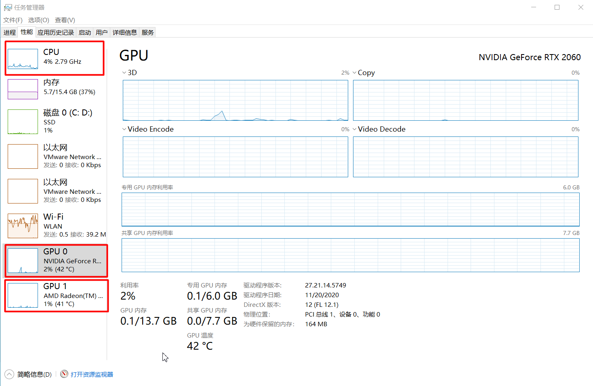

============
电脑硬件属性
============

你有什么问题
------------

- AMD、NVIDIA、Intel 这三家公司分别生产什么产品
- 我们通常说的 AMD 指的是处理器还是显卡
- x86、ARM、AMD 都是架构的名称吗
- 机器学习到底需要什么样的配置
- 如何比较电脑的参数，如何衡量价格划不划算

查看本机参数
------------

共有 5 中查看方式：

- 设置 ``>>`` 系统 ``>>`` 关于
- Win + R ``>>`` msinfo32
- Win + R ``>>`` dxdiag
- PowerShell ``>>`` Get-ComputerInfo
- cmd.exe ``>>`` systeminfo
- 使用工具软件 `CPU-Z <https://www.cpuid.com/>`_

确认是否有 GPU
--------------

打开任务管理器可以查看。

.. hint:: 

    如果你正在用 GPU 训练神经网络，若没有安装 `CUDA Toolkit <https://developer.nvidia.com/cuda-toolkit-archive>`_
    和 `NVIDIA cuDNN <https://developer.nvidia.com/rdp/cudnn-archive>`_
    可能程序一直运行在内存上，内存占用率极高，而 GPU 的使用率几乎没有。
    注意到上图，GPU 那一栏中，分为专用内存和共享内存，实际上跑模型时，只用到了专用内存，共享内存没有发生使用。

比如，安装 PaddlePaddle 成功后，如下图所示：

.. image:: ../../_static/images/paddlepaddle_install.png

