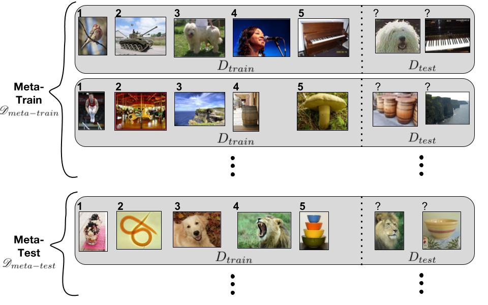

==============
小样本学习介绍
==============

基本概念
--------

深度学习
    针对某一个特定的 task，从 0 开始学习，然后应用到该 task。（一个 task 对应上图中的一行）

元学习
    任务是学会一种先验知识，学会自主学习，这是一个方法和过程，而小样本学习是一种场景。如何学会自主学习？用 Train Set 做训练的过程就是学习先验知识的过程。

小样本学习
    小样本学习是在有先验知识的基础上再进行学习的。
    对于小样本学习，你可以问机器这两张图片是不是同一种东西。
    比如，如果我们给神经网络一张图片（Query），问它这是什么东西时，它可能没见过，不知道如何这个照片属于哪一类。
    但是如果我们能再多提供一点信息（Support Set），它就能从 Support Set 找出 Query 属于哪个类别。
    小样本学习的模型输入是两张图片，或三张图片。输出是相似度函数。

Support Set
    很小的一个数据集，只能在预测时提供一些额外的信息。比如我们想要判断一个未知事物是什么东西的时候，需要与已知事物建立一种联系，这种联系很像查手册。

Train Set
    很大的一个数据集，可以用于训练一个神经网络。让神经网络学会比较异同（具备自主学习的能力，这是我们能够提供的先验），做预测时，给出 Support Set，让它分类。

One Shot Learning
    用一张卡片识别出一种动物叫 One Shot Learning。

k way
    The support set has k classes.

n shot
    Every class has n samples.

相似度函数
    sim(x, x') 理想情况下，如果 x 和 x' 是同一种东西，sim(x, x')=1，否则等于 0。

.. csv-table::
    :header: "名称", "训练阶段", "预测阶段"
    :widths: 15, 35, 50

    "传统机器学习", "学习 Train Set 后，学会识别什么是老虎什么是大象", "如果给定的动物属于 Train Set 中的某个物种，它可以识别这是什么物种，但是对于没见过的动物，它并不认识"
    "小样本学习", "学习 Train Set 后，学会区分不同的事物，学会一些比较异同的规则", "提供 Support Set 后，比较 Query 和 Support Set 中的哪张图片最相似，Query 在 Train Set 中没有见过"

小样本学习一般的工作流程：

- 首先，从一个大数据集中做训练
- 然后，将相似度函数应用到预测上

  - 比较 Query 和 Support Set
  - 找出 Support Set 中最相似的

两个常用的数据集：

- Ominilot
- Mini-ImageNet

孪生网络
--------

构造正负样本（Train Data）
    正样本是从某个类别中选出两张图片，组成一个元组， :math:`(class1, class1, 1)` 。
    负样本是从不同的类别中各选出一张图片，也组成一个三元组， :math:`(class1, class2, 0)` 。

构造模型
    对图片提取特征，生成一个特征向量。
    将两张图片同时输入到网络中，可以得到两个特征向量，对这两个特征向量做差，可以得到它们之间的差异。
    然后，对做差后的特征向量应用全连接神经网络，映射为一个标量，通过 Sigmoid 函数后得到它们之间的相似度。

更新参数
    Ground Truth 为 One hot 向量，这是 :math:`y` 。
    对模型得到的预测值，:math:`\hat{y}` 与标准值 :math:`y` 做 Cross Entropy，记作 Loss。
    为了使 Loss 最小，应用反向传播更新参数。

Triplet Loss
    首先从某个类中选出一个锚点（anchor），然后再从这个类中选出一个正样本（positive sample)，最后从另一个类中选出一个负样本（negative sample），构成三元组 :math:`(pos, anchor, neg)` 。
    将这三张图片都输入到网络中，可以得到三个特征向量 :math:`f(x^+), f(x^a), f(x^-)` 。
    三个向量，两两之间分别计算欧氏距离。
    目标是让正样本的特征向量和锚点的特征向量之间距离越小越好，负样本的特征向量与锚点的特征向量之间的距离越大越好。
    :math:`Loss(x^a, x^+, x^-)=max\{0, d^+ + \alpha - d^-\}` 其中 :math:`\alpha` 是一个超参。更新网络参数，最小化 Loss。

.. note:: 

    近些年，准确率较高的都是 Embedding，把图片映射成特征向量，想法和 Siamese Network 相似。

预训练和微调
------------

这是一个很简单的思路，再大数据集 Train Set 上做 Pretraining，再小数据集 Support Set 上做 Fine Tuning。这种方式虽然简单，但是准确率相对较高。

- Step1: Pretraining

  - Pretrain a CNN on large-scale training data.
  - Use the CNN for feature extraction.

- Step2: Fine Tuning

  - Training a classifier on the support set.
  - Tricks:

    - Using :math:`\mathbf{M}` to initialize :math:`\mathbf{W}`.
    - Entropy regularization.
    - Cosine similarity + Softmax classifier.

- Step3: Few Shot Prediction

  - Map images in the support set to feature vectors.
  - Obtain the mean feature vector of each class, :math:`\mu_1, \mu_2, \dots, \mu_k`
  - Compare the feature of query with :math:`\mu_1, \mu_2, \dots, \mu_k`

Cosine similarity
    衡量两个向量之间的相似度。两个向量的内积等于 :math:`cos\theta=\mathbf{x}^T\mathbf{w}` 。

Softmax Function
    可以把一个向量映射成一个概率分布，通常用于输出层。首先对向量的每一个元素取指数，然后做归一化。每个概率值表示对每个类别的 Confidence。Softmax 会让最大值变大，让最小值变小，突出差异性。

Fine Tuning
    再 Support Set 上学习 :math:`\mathbf{W}` 和 :math:`\mathbf{b}` 就是做 Fine Tuning。
    之前没有学习 :math:`\mathbf{W}` 和 :math:`\mathbf{b}`
    直接让 :math:`\mathbf{b} = 0` ， :math:`\mathbf{W} = \mathbf{M}` 。
    其中 :math:`\mathbf{M}` 是每一个类别的均值向量组成的矩阵。

参考文献
--------

1. `Video of Meta Learning <https://www.youtube.com/watch?v=UkQ2FVpDxHg&list=PLvOO0btloRnuGl5OJM37a8c6auebn-rH2>`_
2. `[金山文档] FSL PPT 01 Introduction.pdf <https://kdocs.cn/l/cpTe5jubAGog>`_
3. `[金山文档] FSL PPT 02 Siamese Network.pdf <https://kdocs.cn/l/cvbUxZGl0zwe>`_
4. `[金山文档] FSL PPT 03 Pretraining and Fine Tuning.pdf <https://kdocs.cn/l/cbBZGuwm26Yr>`_