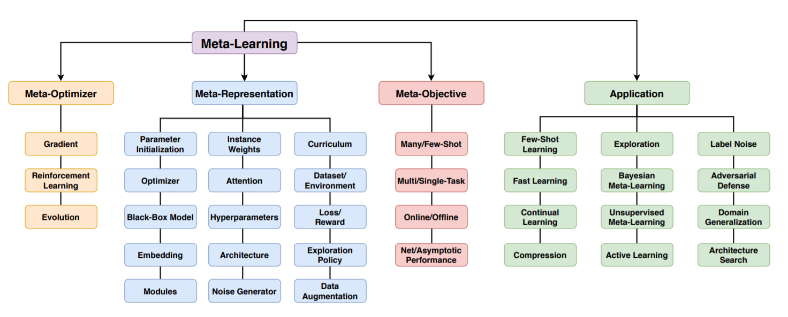
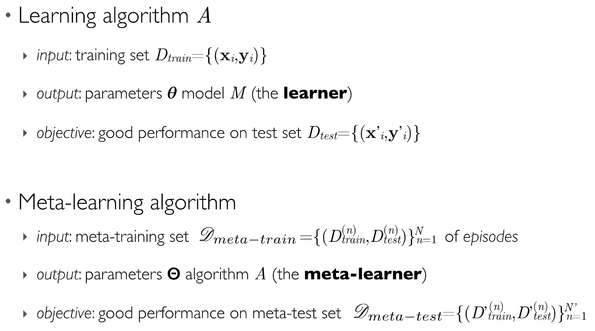
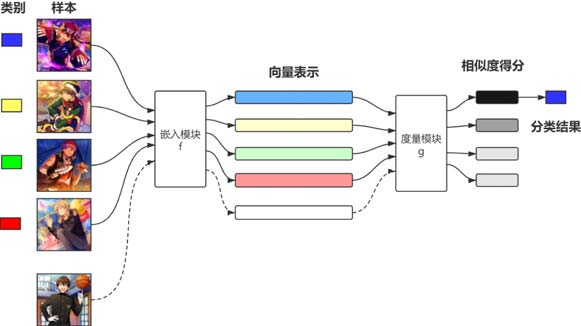

==============
小样本学习介绍
==============

基本概念
--------

小样本学习并不是一个单独的学科领域，而是元学习 [3]_ 的一个特殊应用场景。它是在样本量比较少的情况下对数据进行预测。
如果仅有几张图片，拿来训练肯定是不行的，分分钟过拟合。因此，我们需要某种手段来防止这种过拟合的发生，
现在比较流行的一种思路就是先做预训练，让模型具有某种先验知识，或者说，让模型一定的自主学习能力，然后在此基础上进行微调。

注意这里所说的模型，它通常由两部分组成，一部分用来学习先验知识，另一部分用来微调。

回过头来看机器学习和深度学习。它们通常只有一个模型，而这个模型通常是针对某个特定问题提出的。
当有新问题出现时，模型的泛化能力就出现了问题。元学习致力于解决这个泛化能力，它可以针对一系列问题进行求解。

深度学习做训练，通常情况下是为了让模型具备识别某个事物的能力，也就是当给神经网络一张图片时，它能够看出来，这是一只狗，还是一只猫。
元学习，是为了学习比较异同的规则，也就是说，如果我们同时给网络两张图片，它能看出来，这两张图片是不是同一种东西。

连续读了几天论文，我发现，不管看哪个领域的论文，如果能够记住一些 :ref:`约定俗称的符号 <Meta-FSL-symbols>`
对我们读后面的论文都会有一定的帮助。而且，通常，在刚刚接触新领域时，肯定会碰到一些
:ref:`新的名词或专业术语 <machine-learning-glossary>`，能够及时地做好记录也是一个很好的习惯。

元学习一般将问题分为三类 :footcite:p:`hospedales2020meta` ：

- 元知识的表征：学习元知识应该如何表示，比如，学习权重、学习超参数、学习损失函数等；
- 元学习器：学习应该如何学习问题，比如，可以学习如何更快地梯度下降等；
- 元目标：学习如何更好地在某个特定场景下取得良好效果，比如应用于小样本还是多样本。

元学习一般包括两个学习器，learner 和 meta-learner，每个学习器都有一个超参数，但下图中没写。

- learner 是用来解决手中数据的一个学习器，也叫 base-learner；
- meta-learner 是预训练得到的一个学习器。

读一些相关文献，从论文中的伪代码上可以看出来，它一般包括两层循环，外层循环学习得到 meta-learner，内层循环学习得到 learner。
为了降低难度，我们看图来直观理解一下：

.. image:: ../../_static/images/meta-learning-framework.*

为了能更进一步理解整体的工作过程，考虑一个例子：

.. image:: ../../_static/images/meta-learning.png

假如我有一个 :math:`10` 类的数据，每个类别 :math:`10` 张图片，共 :math:`10 \times 10=100` 张。
那元学习的过程就是，首先设置实验，比如 10-way 5-shot。
meta-train 的过程拿 imagenet 这种数据集 pre-train，meta-test 就是在我自己的数据（ :math:`100` 张图）上面 finetune，
最后拿到那套参数 :math:`\theta` ，然后推理的时候每次就拿这个 :math:`\theta` 算一下前向进行分类。

元学习一般有三种基本解决方法：

- 基于度量的方法（学习事物背后的关联）
  
  - 目标是学习不同样本之间的度量或距离函数；
  - 比如 Siamese Network\ :footcite:p:`koch2015siamese`\ ，Matching Network\ :footcite:p:`vinyals2016matching`\ ，Relation Network\ :footcite:p:`sung2018learning`\ ，Prototypical Network\ :footcite:p:`snell2017prototypical`\ 。

- 基于模型的方法（学习如何建模）
  
  - 目标是让元学习器（Meta-Learner）学习一个后验概率 :math:`P_\theta(y|\mathbf{x})` ；
  - 比如 MANN\ :footcite:p:`santoro2016meta`\ ，Meta Network\ :footcite:p:`munkhdalai2017meta`\ ，TCML\ :footcite:p:`mishra2017meta`\ 。

- 基于优化的方法（学习如何学习）
  
  - 目标是加快模型的求解速度；
  - 比如 LSTM-based\ :footcite:p:`ravi2017optimization`\ :footcite:p:`andrychowicz2016learning`\ ，MAML\ :footcite:p:`finn2017model`\ ，Repitile，RL-based\ :footcite:p:`zoph2016neural`\ :footcite:p:`wang2016learning`\ :footcite:p:`duan2016rl`\ 。

基于度量的方法很好理解，它主要的构件就是嵌入模块和度量模块 [1]_ ：

- 嵌入模块 :math:`f` 将数据样本映射为特征向量；
- 度量模块 :math:`g` 比较待测样本于其他样本的特征向量的相似度。

注：图片中的颜色，每种颜色都会有一个特征向量。把待测样本归类为相似度最高的样本所属的类别。分类器一般选择 Softmax。

基于模型的方法，是学习如何建模。乍一看这个名字，还以为是让算法学习搭建网络结构呢，其实不然。
网络结构还是人为定义好的，他要学习的是一种建立模型的能力，而不是具体的模型，也就是如何从少量数据中求解 :math:`P_\theta(y|\mathbf{x})` 。

神经图灵机的框架 :footcite:p:`DBLP:journals/corr/GravesWD14` 提供了一个通用的模型（见下图），在此基础上衍生出了 MANN 和 Meta Network。

.. image:: ../../_static/images/neural-tuning-machine.png

具体的模型是由记忆产生的，在不同的记忆下，对应不同的函数（Read heads 读取记忆，Write heads 产生记忆）。
对于新任务，模型把数据集载入记忆，Read heads 根据权重合理地读取记忆，就形成了对这个任务的建模。

基于优化的方法，是我们通常讲的，如何学会学习，也就是说，如何学到一个合适的初始化，让模型更快地收敛。比如 MAML :footcite:p:`finn2017model` （见下图）。

.. image:: ../../_static/images/model-agnostic-meta-learning.png

注：图中的粗实线是元学习的过程，灰色线是每个任务（task）。元学习器为每个任务学习优化参数 :math:`\theta_i^*` ，这些优化参数的矢量和为 :math:`\theta` 。
当面对新场景时，用平均后的参数 :math:`\theta` 来初始化新场景，可以更快地收敛。

以上是我于 2021 年 10 月 28 日做的一次 PPT 组会分享，详见 `Slide <https://kdocs.cn/l/cpj5izoyamHE>`_\ 。

然后，更多更加详细的论文方法汇总在下面了\ [2]_\ ：

- **Data Augmentation / Hallucination Based / Sample Synthesis (learn to augment data)**

  - GAN: Covariance-Preserving Adversarial Augmentation Networks - 2018 NeurIPS
  - Low-Shot Learning from Imaginary Data - 2018 CVPR
  - :math:`\Delta`-encoder: Sample Synthesis - 2018 NeurIPS
  - Semantic Feature Augmentation - 2018 arXiv

- **Metric-Learning Based (learn to compare)**

  - Siamese Network - 2015 ICML
  - Matching Network - 2016 NIPS
  - Prototype Network - 2017 NIPS
  - Relation Network - 2018 CVPR
  - Covariance Metric Network - 2019 AAAI
  - Deep Nearest Neighbor Neural Network - 2019 CVPR
  - Large Margin Meta-Learning - 2018 arXiv
  - RepMet: Few-Shot Detection - 2019 CVPR

- **Meta-Learning Based (learn to learn)**

  - **Recurrent meta-learners**

    - Matching Network - 2016 NIPS
    - `MANN: Memory-Augmented Neural Network <https://kdocs.cn/l/crnNROG2VCMf>`_ - 2016 ICML

  - **Optimizers**

    - MAML: Model-Agnostic Meta-Learning - 2017 ICML
    - Meta-SGD - 2017 arXiv
    - LEO: Meta-Learning with Latent Embedding Optimization - 2019 ICLR
    - Reptile - 2018 arXiv
    - Meta-Learner LSTM - 2017 ICLR
    - Dynamic FSL - 2018 CVPR
    - MTL: Meta-Transfer Learning - 2019 CVPR
    - Meta Network - 2017 ICML

- **Finetune Based**

  - Baseline for Few-Shot Image Classification - 2019 arXiv

例: 孪生网络
------------

构造正负样本（Train Data）
    正样本是从某个类别中选出两张图片，组成一个元组， :math:`(class1, class1, 1)` 。
    负样本是从不同的类别中各选出一张图片，也组成一个三元组， :math:`(class1, class2, 0)` 。

构造模型
    对图片提取特征，生成一个特征向量。
    将两张图片同时输入到网络中，可以得到两个特征向量，对这两个特征向量做差，可以得到它们之间的差异。
    然后，对做差后的特征向量应用全连接神经网络，映射为一个标量，通过 Sigmoid 函数后得到它们之间的相似度。

更新参数
    Ground Truth 为 One hot 向量，这是 :math:`y` 。
    对模型得到的预测值，:math:`\hat{y}` 与标准值 :math:`y` 做 Cross Entropy，记作 Loss。
    为了使 Loss 最小，应用反向传播更新参数。

Triplet Loss
    首先从某个类中选出一个锚点（anchor），然后再从这个类中选出一个正样本（positive sample)，最后从另一个类中选出一个负样本（negative sample），构成三元组
    :math:`(pos, anchor, neg)` 。
    将这三张图片都输入到网络中，可以得到三个特征向量 :math:`f(x^+), f(x^a), f(x^-)` 。
    三个向量，两两之间分别计算欧氏距离。
    目标是让正样本的特征向量和锚点的特征向量之间距离越小越好，负样本的特征向量与锚点的特征向量之间的距离越大越好。
    :math:`Loss(x^a, x^+, x^-)=max\left\{0, d^+ + \alpha - d^-\right\}` 其中 :math:`\alpha` 是一个超参。更新网络参数，最小化 Loss。

.. note:: 

    近些年，准确率较高的都是 Embedding，把图片映射成特征向量，想法和 Siamese Network 相似。

预训练和微调
------------

这是一个很简单的思路，在大数据集 Train Set 上做 Pretraining，在小数据集 Support Set 上做 Fine Tuning。
这种方式虽然简单，但是准确率相对较高。代码实现参考《迁移学习简明手册\ :footcite:p:`WangTLTutorial2018cn`\ 》上手实践部分。

- Step1: Pretraining

  - Pretrain a CNN on large-scale training data.
  - Use the CNN for feature extraction.

- Step2: Fine Tuning

  - Training a classifier on the support set.
  - Tricks:

    - Using :math:`\mathbf{M}` to initialize :math:`\mathbf{W}`.
    - Entropy regularization.
    - Cosine similarity + Softmax classifier.

- Step3: Few Shot Prediction

  - Map images in the support set to feature vectors.
  - Obtain the mean feature vector of each class, :math:`\mu_1, \mu_2, \dots, \mu_k`
  - Compare the feature of query with :math:`\mu_1, \mu_2, \dots, \mu_k`

Cosine similarity
    衡量两个向量之间的相似度。两个向量的内积等于 :math:`cos\theta=\mathbf{x}^T\mathbf{w}` 。

Softmax Function
    可以把一个向量映射成一个概率分布，通常用于输出层。首先对向量的每一个元素取指数，然后做归一化。每个概率值表示对每个类别的 Confidence。
    Softmax 会让最大值变大，让最小值变小，突出差异性。

Fine Tuning
    再 Support Set 上学习 :math:`\mathbf{W}` 和 :math:`\mathbf{b}` 就是做 Fine Tuning。
    之前没有学习 :math:`\mathbf{W}` 和 :math:`\mathbf{b}`
    直接让 :math:`\mathbf{b} = 0` ， :math:`\mathbf{W} = \mathbf{M}` 。
    其中 :math:`\mathbf{M}` 是每一个类别的均值向量组成的矩阵。

应用场景
--------

.. raw:: html

    <iframe 
        width="560" height="315" 
        src="https://www.youtube.com/embed/1eYqV_vGlJY" 
        title="YouTube video player" 
        frameborder="0" 
        allow="accelerometer; autoplay; clipboard-write; encrypted-media; gyroscope; picture-in-picture" 
        allowfullscreen>
    </iframe>

资料调研
--------

科普视频
~~~~~~~~

- 元学习与小样本学习 `王树森 <https://space.bilibili.com/1369507485>`__
  on `哔哩哔哩 <https://www.bilibili.com/medialist/play/ml1245757985/BV1B44y1r75K>`__
  Slide `Introduction <https://kdocs.cn/l/cpTe5jubAGog>`_/\ 
  `Siamese Network <https://kdocs.cn/l/cvbUxZGl0zwe>`_/\ 
  `Pretraining & Fine Tuning <https://kdocs.cn/l/cbBZGuwm26Yr>`_
- 深度强化学习 `王树森 <https://www.youtube.com/c/ShusenWang>`__
  on `YouTube <https://www.youtube.com/watch?v=vmkRMvhCW5c&list=PLvOO0btloRnsiqM72G4Uid0UWljikENlU>`__
  Slide `Intro <https://kdocs.cn/l/cnurQ40MrFLJ>`_/\
  `Value-Based <https://kdocs.cn/l/couQ5BWFzS57>`_/\
  `Policy-Based <https://kdocs.cn/l/cguX6PpD6QSb>`_/\ 
  `Actor-Critic Methods <https://kdocs.cn/l/cbNH5Phx6tnZ>`_/\ 
  `Model-Based <https://kdocs.cn/l/ceckin3M9Eat>`_
- 王树森课程讲义 `深度强化学习.PDF <https://kdocs.cn/l/cmGWnLP1u5VF>`__

科普博文
~~~~~~~~

- `Model-Agnostic Meta-Learning（MAML）模型介绍及算法详解 <https://zhuanlan.zhihu.com/p/57864886>`_
- `MAML算法，model-agnostic metalearnings? <https://www.zhihu.com/question/266497742>`_
- `元学习的前世今生 <https://zhuanlan.zhihu.com/p/146877957>`_
- `从 CVPR 2019 一览小样本学习研究进展 <https://www.leiphone.com/category/academic/4wc0990rNQf43mss.html>`_ 每年 CVPR 都会有针对小样本学习的一个总结
- `Learning to learn - The Berkeley Artificial Intelligence Research <https://bair.berkeley.edu/blog/2017/07/18/learning-to-learn/>`_
- `Meta-Learning: Learning to Learn Fast <https://lilianweng.github.io/lil-log/2018/11/30/meta-learning.html>`_ 
  及 `译文 <https://wei-tianhao.github.io/blog/2019/09/17/meta-learning.html>`__
- `元学习（Meta Learning）与迁移学习（Transfer Learning）的区别联系是什么？ <https://www.zhihu.com/question/299020462/answer/1009811572>`_
- `How to train your MAML: A step by step approach <https://www.bayeswatch.com/2018/11/30/HTYM/>`_
- `An Introduction to Meta-Learning <https://medium.com/walmartglobaltech/an-introduction-to-meta-learning-ced7072b80e7>`_
- `From zero to research — An introduction to Meta-learning <https://medium.com/huggingface/from-zero-to-research-an-introduction-to-meta-learning-8e16e677f78a>`_
- `Meta Reinforcement Learning <https://lilianweng.github.io/lil-log/2019/06/23/meta-reinforcement-learning.html>`_
- `Meta-Learning: Learning to Learn Fast <https://lilianweng.github.io/lil-log/2018/11/30/meta-learning.html>`_

领域综述
~~~~~~~~

- Generalizing from a Few Examples: A Survey on Few-Shot Learning `笔记 <https://kdocs.cn/l/ce6RjgEp9WT9>`_ 
  及 `文章解读 <https://zhuanlan.zhihu.com/p/129786553>`_
- `Meta-Learning in Neural Networks: A Survey <https://arxiv.org/pdf/2004.05439.pdf>`_
- `A CLOSER LOOK AT FEW-SHOT CLASSIFICATION <https://arxiv.org/pdf/1904.04232.pdf>`_
- `A Baseline for Few-Shot Image Classification <https://arxiv.org/pdf/1909.02729.pdf>`_

教学视频
~~~~~~~~

- CS 330: Deep Multi-Task and Meta Learning `主页 <http://cs330.stanford.edu/>`__ 或 `哔哩哔哩 <https://www.bilibili.com/video/BV1He411s7K4>`__ 17.75 小时
- Chelsea Finn: Meta-Learning: from Few-Shot Learning to Rapid  Reinforcement Learning `主页 <https://sites.google.com/view/icml19metalearning>`__
  或 `哔哩哔哩 <https://www.bilibili.com/video/BV1o4411A7YE>`__
- Chelsea Finn: Building Unsupervised Versatile Agents with Meta-Learning `YouTube  <https://www.youtube.com/watch?v=i05Fk4ebMY0>`__ 1 小时
- 李宏毅：Meta Learning `YouTube <http://speech.ee.ntu.edu.tw/~tlkagk/courses_ML20.html>`__
  或 `哔哩哔哩 <https://www.bilibili.com/video/BV1pQ4y1K7cw?p=32>`__

特邀演讲
~~~~~~~~

- Generalizing from Few Examples with Meta-Learning by Hugo Larochelle `Video <https://www.bilibili.com/video/av61821192/>`__ 
  及 `Slides <https://kdocs.cn/l/cpswKp8xJuZj>`__
- Workshop on Meta-Learning (MetaLearn 2021) `Video <https://meta-learn.github.io/>`__
- Deep Learning: Bridging Theory and Practice `Video <https://ludwigschmidt.github.io/nips17-dl-workshop-website/>`__
- Challenges in Multi-Task Learning and Meta-Learning `Video <https://www.youtube.com/watch?v=Rq40Bze_hMA>`__ 
  及 `Slides <https://ai.stanford.edu/~cbfinn/_files/ias_slides.pdf>`__
- The Big Problem with Meta-Learning and How Bayesians Can Fix It 
  `Video <https://slideslive.com/38922670/invited-talk-the-big-problem-with-metalearning-and-how-bayesians-can-fix-it>`__ 
  及 `Slides <https://ai.stanford.edu/~cbfinn/_files/neurips19_memorization.pdf>`__

算法实现
--------

- `Papers With Code: Few-Shot Learning <https://paperswithcode.com/task/few-shot-learning>`_

数据集 
~~~~~~

- `Omniglot data set for one-shot learning <https://github.com/brendenlake/omniglot>`_ 及 `Paper <https://kdocs.cn/l/cgtqdhdNglDz>`_
- `Tools for mini-ImageNet Dataset <https://github.com/yaoyao-liu/mini-imagenet-tools>`_
- `ImageNet Large Scale Visual Recognition Challenge (ILSVRC) <https://image-net.org/challenges/LSVRC/>`_
- `FGVC-Aircraft Benchmark <https://www.robots.ox.ac.uk/~vgg/data/fgvc-aircraft/>`_
- `Caltech-UCSD Birds-200-2011 <http://www.vision.caltech.edu/visipedia/CUB-200-2011.html>`_
- `google-research/meta-dataset <https://github.com/google-research/meta-dataset>`_
- `relevant-awesome-datasets-repo - Few shot <https://github.com/Duan-JM/awesome-papers-fewshot#relevant-awesome-datasets-repo>`_
- 评价强化学习模型效果的工具： `OpenAI Gym <http://gym.openai.com/>`_

领域学者
--------

- `Chelsea Finn <https://ai.stanford.edu/~cbfinn/>`_, UC Berkeley
- `Pieter Abbeel <https://people.eecs.berkeley.edu/~pabbeel/>`_, UC Berkeley
- `Erin Grant <https://people.eecs.berkeley.edu/~eringrant/>`_,UC Berkeley
- `Raia Hadsell <http://raiahadsell.com/index.html>`_, DeepMind
- `Misha Denil <http://mdenil.com/>`_, DeepMind
- `Adam Santoro <https://scholar.google.com/citations?hl=en&user=evIkDWoAAAAJ&view_op=list_works&sortby=pubdate>`_, DeepMind
- `Sachin Ravi <http://www.cs.princeton.edu/~sachinr/>`_, Princeton University
- `David Abel <https://david-abel.github.io/>`_, Brown University
- `Brenden Lake <https://cims.nyu.edu/~brenden/>`_, Facebook AI Research

.. rubric:: 参考资料

.. [1] 赵凯琳,靳小龙,王元卓.小样本学习研究综述.软件学报,2021,32(2):349-369
.. [2] `小样本学习与元学习资料调研：白小鱼 <https://youngfish42.yuque.com/docs/share/5cd14926-6954-4dca-bf39-d17c56fece53>`_
.. [3] `Meta learning (computer science) <https://en.wikipedia.org/wiki/Meta_learning_(computer_science)>`_
.. footbibliography::
