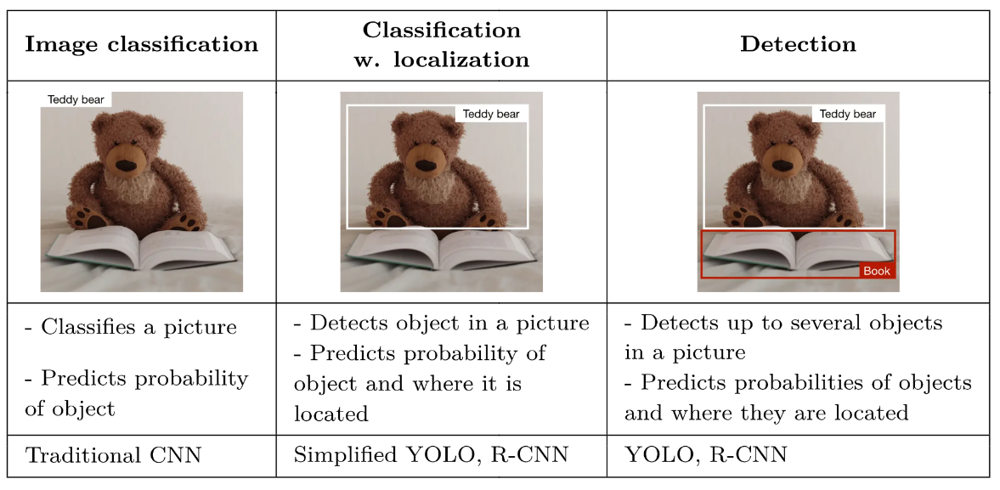
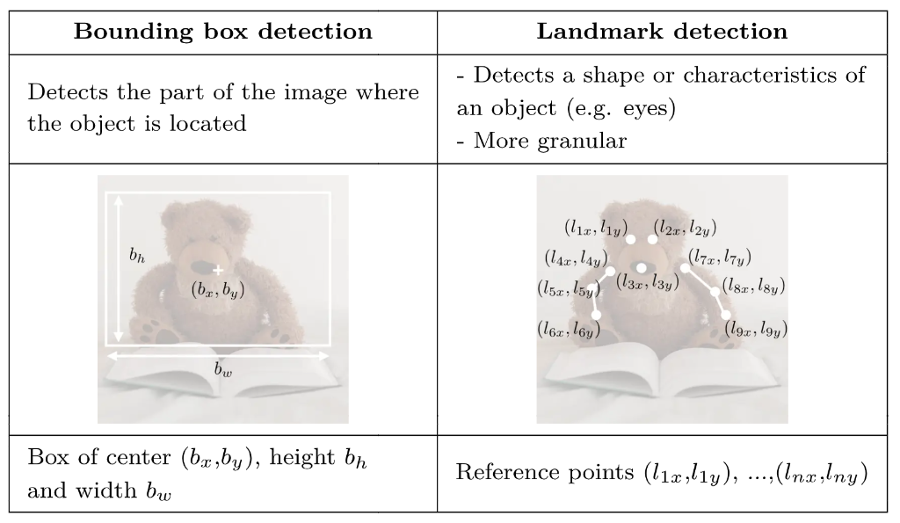
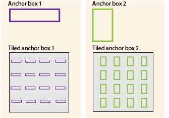
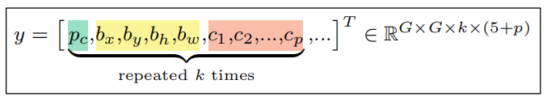
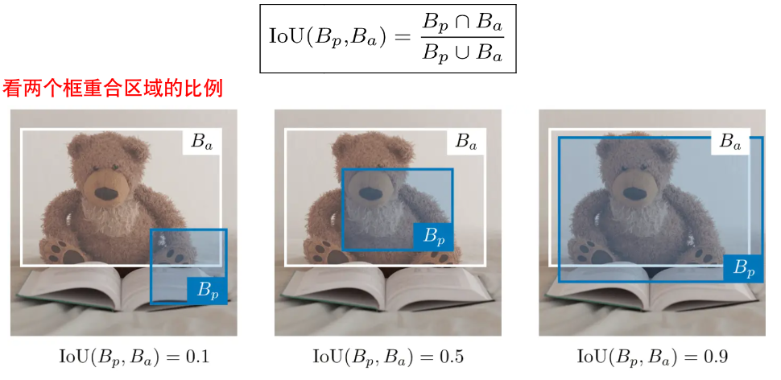
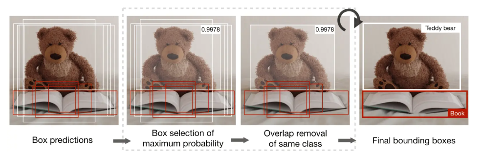
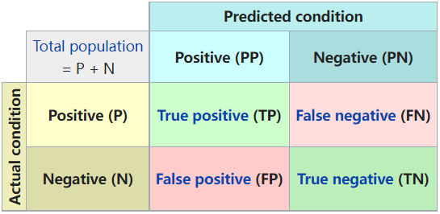
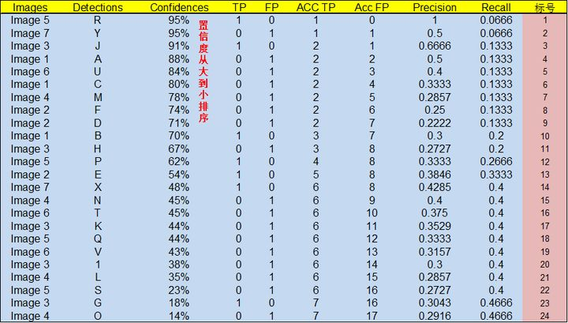
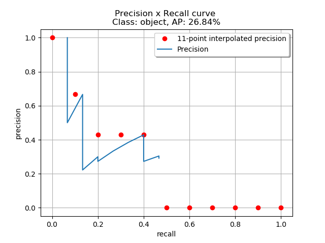

============
目标检测介绍
============

基本概念
--------

目标检测，从字面意思上来看，它是说从一幅图像中识别出目标。

目标检测主要分为三类 [6]_ ：

- 图像分类，预测图像中是否包含某个目标，代表算法如 CNN；
- 预测图像中是否包含某个目标，并对它进行定位，代表算法如 YOLO，R-CNN；
- 预测图像中包含的多个目标，并对他们进行定位，代表算法如 YOLO，R-CNN。

研究这三类问题主要有两种方法：

- 边界框检测（注，bbox = Bounding Box）
- 特征点检测（landmark detection）

需要注意的是，边界框和锚框的区别：锚框是一组预定义的大小确定的边界框。
目标检测算法通常会在输入图像中采样大量的区域，然后判断这些区域中是否包含我们感兴趣的目标，
并调整区域边缘从而更准确低预测目标的真实边界框（ground-truth bounding box） [4]_ 。
需要注意的是，以像素为中心分别生成多个大小不等的锚框，指的是通常意义上的滑动窗口。
滑动窗口的运算量极大，包含大量的重复计算，因此出现了像 YOLO 这样的改进算法。

不同的算法会采用不用的采样方法。以 YOLO 为例（上图所示 [5]_ ），它首先将图像划分为网格结构，每个网格都是一个锚框。
所有锚框以平铺的方式占满图像，对每个网格应用 CNN 预测 :math:`y` ，进而调整区域边缘。
YOLO 的锚框可以看成是 :math:`stride = b_w` 的滑动窗口。

如果一幅图像中包含多个目标，可以同时设定多个大小不等的锚框，分别平铺整个图像。而预测步骤与前述无异。

需要注意的是，目标检测通常也是监督学习方法，我们需要设定标签，通常情况下有两种设置方式：

1. 左上角坐标 :math:`(x_1, y_1)` ，右下角坐标 :math:`(x_2, y_2)` ，合起来 :math:`(x_1, y_1, x_2, y_2)` 。
2. 中心点坐标 :math:`(b_x, b_y)` ，锚框高度 :math:`b_h` ，锚框宽度 :math:`b_w` ，合起来 :math:`(b_x, b_y, b_h, b_w)` 。

两种方式任选一种，然后整个网络的标签可以用如法方式表示：

模型训练完成后，通常用交并比（Intersection over Union，IoU）来评价模型效果：

常用的基本思路是：1）生成多个候选框，2）计算每个候选框的概率，3）使用非最大抑制方法移除部分候选框。

非极大值抑制（Non-Maximum Suppression，NMS）算法流程：

假设现在有 6 个候选框（A、B、C、D、E、F）对小熊进行预测，

1. 首先计算每个候选框的概率，保留概率最大的候选框，比如 F；
2. 将 F 和其余 5 个候选框计算 IoU，去除结果大于阈值的候选框，比如 A、C、E；
3. 在剩下的 B、D 中，保留概率较大者，重复步骤 2、3，对比 B 和 D。

就这样一直重复，找到所有被保留下来的矩形框 [7]_ [8]_。多分类对每个类别分别应用 NMS [8]_。

以上是我于 2021 年 11 月 22 日 `PPT <https://kdocs.cn/l/cd1NvZhHxEyh>`_ 中的部分摘录。

评价指标
--------

如果是检测单个类别，常用 AP 值来衡量模型的好坏，如果是多个类别，通常用 mAP。

- AP：Average Precision
- mAP：mean Average Precision

.. math::

  AP = \frac{1}{11} \sum_{r \in \{0, 0.1,0.2,...,1\}} p_{interp} (r) 

其中，:math:`p_{interp}(r) = \max\limits_{\tilde{r};\tilde{r} \ge r} p(\tilde{r})` ，
:math:`p(\tilde{r})` 是召回值为 :math:`\tilde{r}` 时的精度。
关于波浪线符号的含义写在\ :ref:`另一篇文章 <symbol-definition>`\ 了。

mAP 计算的是 :math:`IoU\_threshold = [0.5, 0.55, 0.6, 0.65, 0.7, 0.75, 0.8, 0.85, 0.9, 0.95]`
时，各个类别 AP 的均值。

上文提到召回值（Recall）以及还有未提及的准确率（Precision）。翻译成查全率和查准率会更容易理解。

查全率指的是，对于 ground-truth 中标出来的检测框，预测结果能否全覆盖？要理解这句话，要明白，
我们通常只会标注正样本，也通常只会预测正样本。如果有一块区域没预测或没标注，默认就是负样本。
而且，这里的全覆盖指的是\ **数量上的全覆盖**\ ，而不是面积上的全覆盖，如果你预测的框和真实框只重合了一个角，
也叫覆盖。只不过他们的覆盖面积不大，在计算 IoU 时，跟 IoU_threshod 比较一下，如果覆盖面积太小，这个就不计数了。

查准率指的是，在你预测出来的所有检测框中，有多少预测对了，也就是说，有多少 IoU 超过了 IoU_threshod 的检测框被计数了。

进一步地，我们从维基百科中搜索一下\ 
`混淆矩阵 <https://en.wikipedia.org/wiki/Confusion_matrix>`_\ ，会有下面这张图：

- ``true`` ：预测对了
- ``false`` ：预测错了
- ``positive`` ：正样本
- ``negative`` ：负样本

图中背景为绿色表示你的预测是对的，如果背景是红色表示预测错了。
我们一般评测的是正样本（Positive）的准确率和覆盖率。计算公式如下：

.. math::

  Precision = \frac{TP}{TP + FP} \quad \text{(第一列)}\\\\
  Recall = \frac{TP}{TP + FN} \quad \text{(第一行)}

因为我们通常只标注正样本，所以 TN 那部分不太关注，就没在公式中体现了。
也可以这样理解，没有预测到的都是负样本，没有标注的也都是负样本。

mAP 更加详细的计算过程，知乎网友 [9]_ 给了一个说明。

.. image:: ../../_static/images/precision-recall.png
  :align: center

看上图，绿色是真实框，红色是预测框。注意，图中的百分数是置信度，不是 IoU。走一遍流程：

.. image:: ../../_static/images/map-workflow.*
  :align: center

遍历所有的真实框，统计出 TP、FP 的数值（FN 的值不用统计，因为我们是有监督学习，TP + FN = 所有标注样本的数量）。

然后，所有预测框根据置信度排序，求出 Precision 和 Recall 的值。

最后，画出 Precision-Recall 曲线，计算曲线下的面积，得到 AP 和 mAP 的结果，就可以评估我们的模型了。

计算 AP 时，在 PR 曲线上取每个点右侧最大的 Precision 作为该点处的 Precision。
要计算 mAP，就把所有类别的 AP 计算出来，然后求取平均即可。

技术分类
--------

- Anchor based

  - One-stage（速度更快）：SSD、DSSD、\ **RetinaNet**\ 、RefineDet、YOLOV3
  - Two-stage（精度更高）：Faster-RCNN、R-FCN、FPN、Cascade R-CNN、SNIP

- Anchor-free

  - Keypoint：CornerNet、CenterNet、CornerNet-Lite
  - Segmentation：FSAF、\ **FCOS**\ 、FoveaBox

Anchor-based
    与锚点框相关超参 (scale、aspect ratio、IoU Threshold) 会较明显的影响最终预测效果；
    预置的锚点大小、比例在检测差异较大物体时不够灵活；
    大量的锚点会导致运算复杂度增大，产生的参数较多；
    容易导致训练时 negative 与 positive 的比例失衡。

Anchor-free
    使用类似分割的思想来解决目标检测问题；
    不需要调优与 anchor 相关的超参数；
    避免大量计算 GT boxes 和 anchor boxes 之间的 IoU，使得训练过程占用内存更低。

Label Assignment in Object Detection
    label assignment 就是要对目标检测中的 anchor box 或者 anchor point 打上 label，
    是positive、negative 还是 ignore。这里面有两个挑战，一个挑战是 negative 非常多，容易导致样本不均衡问题；
    另一个挑战是判定标准只能经验性地设置，然后通过实验结果来验证，基本是一个 trial and error 的过程 [1]_ 。
    另外，参考 [2]_ [3]_
    

相关工具
--------

- `MMDetection <https://mmdetection.readthedocs.io/en/latest/>`_

参考文献
--------

.. [1] https://zhuanlan.zhihu.com/p/166275032
.. [2] https://zhuanlan.zhihu.com/p/160991530
.. [3] https://zhuanlan.zhihu.com/p/136048045
.. [4] `边界框（bounding box） — PaddleEdu documentation <https://paddlepedia.readthedocs.io/en/latest/tutorials/computer_vision/object_detection/Bounding_Box_Anchor.html>`_
.. [5] `Anchor Boxes for Object Detection - MATLAB & Simulink - MathWorks 中国 <https://ww2.mathworks.cn/help/vision/ug/anchor-boxes-for-object-detection.html>`_
.. [6] `[金山文档] super-cheatsheet-deep-learning.pdf <https://kdocs.cn/l/caIiLHnpo5UV>`_
.. [7] `[金山文档] 动手学深度学习（第 2 版）PyTorch 实现 13.4.锚框 <https://kdocs.cn/l/crOymfQ4SKRt>`_
.. [8] https://www.cnblogs.com/makefile/p/nms.html
.. [9] https://www.zhihu.com/question/53405779/answer/993913699
